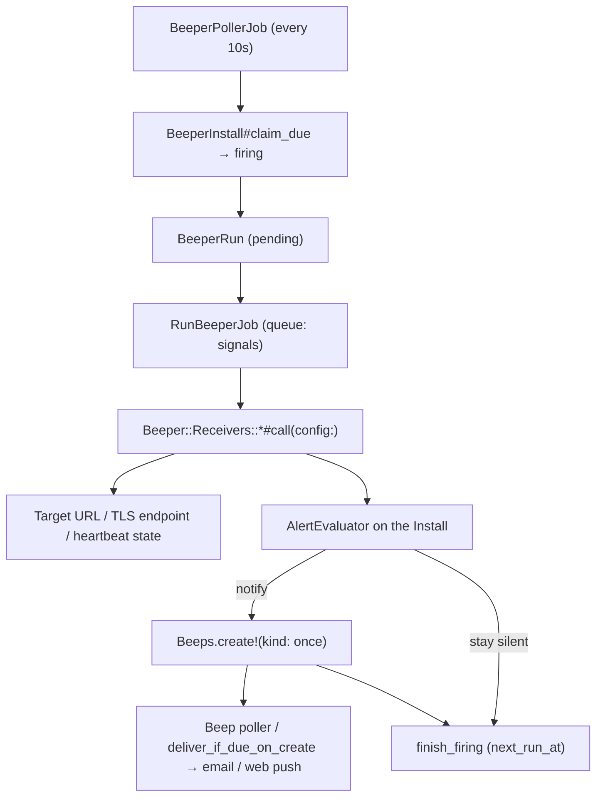

# Beeper Ecosystem

A **Beeper** is a catalog definition (manifest + receiver). An **Install** is an account-owned running instance of that Beeper: config, cron, alert state, and default channels. When the alert state machine says to notify, the Install creates a one-shot **Beep**. Beep is only the notification; it never produces a signal.

Terms: [`TERMS.md`](../TERMS.md). Remaining work lives in [`TODO.md`](../../TODO.md), not here.



---

## Decisions

These four are load-bearing; everything below follows from them.

**1. Beep `kind` stays `once | recurring` and is only the notification recurrence axis.** It does not mean “this row is a monitor.” User-created reminders stay `once` or `recurring`. Beeper-generated Beeps are always `kind: once`. Install cron lives on the Install, never on that Beep.

**2. Probe outcome lives on `beeper_runs`, delivery outcome on `beep_runs`.** `beeper_runs.signal_status` (`ok` / `alerting` / `error`) is the signal result. `beep_runs.status` (`pending running succeeded failed …`) means *did we deliver*. A healthy probe that creates no Beep is not a skipped or failed delivery.

**3. Notification is a decision on the Install; a notify creates a new once Beep.** The alert state machine (`AlertEvaluator`) runs against the Install. `should_notify` → `Beeps.create!(kind: once, …)` with channels copied onto the Beep and optional `beeper_install_id` so the inbox can point back at the Install. Delivery then uses the existing Beep path. One notify event → one Beep → N channel types on that Beep (same BeepRun). A 5-minute schedule does not email every 5 minutes for the whole outage.

**4. Official receivers stay in-process Ruby behind `Beeper::Receivers::*`.** No JS sandbox and no new service in this period. Site Uptime and SSL expiry are small `Net::HTTP` / `OpenSSL` classes. The `Beeper::Receivers::Base` interface is the seam: a sandboxed runner later is an implementation change behind it, not a refactor of Install / Beep.

---

## Data model

Beeper **definition**, **Install**, and **notification Beep** are different records. Probe state must not live on `beeps` / `beep_runs`.

### `beepers` (catalog)

| Column       | Type   | Notes                                                        |
| ------------ | ------ | ------------------------------------------------------------ |
| `slug`       | string | `site-uptime`. Unique per owner.                             |
| `account_id` | uuid   | `nil` = official. Set = custom, private to that account.     |
| `version`    | string | Semver from the manifest.                                    |
| `manifest`   | json   | Validated against the contract on write.                     |
| `source`     | text   | Null for official receivers (Ruby classes). Custom JS later. |

This period writes official rows only (`account_id` nil). Official rows are seeded from `apps/beepers/*/manifest.json`; the seed is idempotent on slug for official beepers.

### `beeper_installs` (running instance)

| Column                  | Type     | Notes                                                             |
| ----------------------- | -------- | ----------------------------------------------------------------- |
| `account_id`            | uuid     | Owner account.                                                    |
| `beeper_id`             | uuid     | Catalog Beeper.                                                   |
| `title`                 | string   | Monitor name the user typed (`example.com availability`).         |
| `config`                | json     | User answers to `inputs`. Encryption is out of scope this period. |
| `cron`                  | string   | Install schedule. Not copied onto the notification Beep.          |
| `timezone`              | string   | IANA.                                                             |
| `status`                | string   | Same strings as Beep (`active`, `paused`, `firing`, …).           |
| `next_run_at`           | datetime | Claimed by the Beeper poller.                                     |
| `last_run_at`           | datetime | Last finished Beeper Run.                                         |
| `alert_state`           | string   | `ok` or `alerting`. Default `ok`. Lives here, not on Beep.        |
| `consecutive_failures`  | integer  | Default 0. Reset on `ok`.                                         |
| `schedule_offset`       | integer  | Seconds. Spreading a shared `*/5 * * * *` is later work.          |
| `ping_token`            | string   | Unique, nullable. Issued when the manifest sets `ingest.webhook`. |
| `last_ping_at`          | datetime | Stamped by the ping endpoint, read by the Heartbeat receiver.     |
| `notification_channels` | json     | Default channel types for notify (`email`, `web_push`).           |

Do not reuse `status: firing` for alerting — there it means *a Beeper Run is in flight*. `alert_state` is a separate column on purpose.

### `beeper_runs` (probe)

| Column              | Type     | Notes                                                                |
| ------------------- | -------- | -------------------------------------------------------------------- |
| `beeper_install_id` | uuid     | Owning Install.                                                      |
| `scheduled_for`     | datetime | Unique per Install.                                                  |
| `status`            | string   | Probe job lifecycle (`pending running succeeded failed …`).          |
| `signal_status`      | string   | `ok`, `alerting`, or `error`.                                        |
| `signal_result`      | json     | `{ title, message, metrics, log }`. **Capped at 8 KB** before write. |

### `beeps` (notification only)

| Column                  | Type | Notes                                                               |
| ----------------------- | ---- | ------------------------------------------------------------------- |
| `notification_channels` | json | Channel types on this Beep. Delivery reads this list, not the User. |
| `beeper_install_id`     | uuid | Nullable FK. Set when a Beeper notify created this Beep.            |

Copied from the Install at notify (else owner `User#notification_channels`). Recipients stay `account.owner_user` — team fan-out is out of scope here.

### Columns removed

From `beeps`: `plugin_id`, `plugin_config`, `alert_state`, `consecutive_failures`, `schedule_offset`, `ping_token`, `last_ping_at`.

From `beep_runs`: `check_status`, `check_result`. Delivery metadata stays in `beep_runs.result`.

---

## Alert state machine

`error` (the signal logic itself broke: DNS blip, timeout, 5xx from a future runner, bad script) is not the same as `alerting` (the target is genuinely bad), but both count toward the threshold so a flapping signal does not spam.

Notify means **create a Beep** (`Beeps.create!(kind: once)`), not deliver from the Beeper Run.

| Previous `alert_state` | `signal_status`      | Notify                            | Next state                                      |
| ---------------------- | -------------------- | --------------------------------- | ----------------------------------------------- |
| `ok`                   | `ok`                 | no                                | `ok`, counter 0                                 |
| `ok`                   | `alerting` / `error` | only when counter + 1 ≥ threshold | `alerting` if notified, else `ok` (counter + 1) |
| `alerting`             | `alerting` / `error` | no (already alerting)             | `alerting`, counter + 1                         |
| `alerting`             | `ok`                 | **yes — recovery**                | `ok`, counter 0                                 |

Threshold comes from the manifest (`failure_threshold`, default 2) and is user-overridable. Created Beep copy distinguishes "target is failing" from "the signal could not be produced"; an Install with many consecutive `error` results is surfaced as broken in the UI rather than reported as an outage.

`EXPIRED_AFTER = 1.hour` applies to Installs: a probe result an hour late is worthless, so an expired Beeper Run is dropped without evaluating or notifying. Reminder Beeps keep today's late-is-better-than-never behaviour.

---

## Receiver interface

```ruby
# Beeper::Signal = Data.define(:status, :title, :message, :metrics)
#   status: :ok | :alerting | :error

class Beeper::Receivers::SiteUptime < Beeper::Receivers::Base
  def call
    # → Beeper::Signal
  end
end
```

Signals run on their own Solid Queue queue (`signals`), never on `default`. A slow target must not delay reminder delivery — reminders are the core product, and `queue.yml` already runs separate workers.

---

## Manifest contract

```json
{
  "manifest_version": 1,
  "slug": "site-uptime",
  "name": "Site Uptime & Health Check",
  "version": "1.0.0",
  "description": "HTTP status and latency probe",
  "author": "Beep Official",
  "schedule": {
    "default_cron": "*/5 * * * *",
    "min_interval_seconds": 60,
    "failure_threshold": 2
  },
  "ingest": { "webhook": false },
  "inputs": [
    { "name": "target_url",      "label": "Target URL", "type": "url",     "required": true },
    { "name": "expected_status", "label": "Expected status", "type": "number", "default": 200, "min": 100, "max": 599 },
    { "name": "timeout_ms",      "label": "Timeout (ms)", "type": "number", "default": 3000, "max": 10000 }
  ],
  "metrics": [
    { "name": "latency_ms", "label": "Latency", "type": "number", "unit": "ms" },
    { "name": "status",     "label": "HTTP status", "type": "number" }
  ]
}
```

- **`manifest_version`** is mandatory. Third-party beepers are an explicit later goal, so forward compatibility has to exist before the first beeper ships.
- **`inputs[].type`** is `string | number | boolean | url | enum | secret`. `secret` inputs are masked in the UI. `enum` carries `options`. Validation keys: `required`, `min`, `max`, `pattern`. The install / settings form is generated from this, so the schema must be rich enough — widening it later is a breaking change for Installs.
- **`metrics`** must be declared. Charting latency over time needs names, types and units up front.
- **`min_interval_seconds`** is enforced by comparing two consecutive `Fugit#next_time` values against it, rejecting the cron otherwise. Enforcement is later work.
- **`ingest.webhook`** grants the Install a ping token (see Heartbeat below).
- **`schedule.default_cron`** is a starting point only; `schedule_offset` is meant to spread installs so every account does not fire at `:00` / `:05`.

Manifest validation is hand-rolled against this fixed shape. Adding a JSON-Schema gem is an open question, not a decision.

---

## Built-in beepers

| Beeper             | Trigger                 | Implementation                                           |
| ------------------ | ----------------------- | -------------------------------------------------------- |
| Site Uptime        | schedule                | `Net::HTTP`; asserts status code, records latency        |
| SSL / TLS expiry   | schedule                | `OpenSSL::SSL` peer cert; alerts under N days remaining  |
| Heartbeat (Snitch) | schedule + inbound ping | Reads `last_ping_at`; alerts when the window is exceeded |

Heartbeat is not an outbound probe. It fits the same interface: the inbound `POST /ping/:token` endpoint only stamps `last_ping_at` on the Install, and the *scheduled* probe evaluates staleness locally. That endpoint is public and unauthenticated by nature (that is the product), so it needs rate limiting per token, an opaque high-entropy token, and no response body that leaks account information.

---

## Security

**SSRF is the main exposure** — `target_url` is user-supplied and the Ruby receiver fetches it, sandbox or not. Without egress control, receivers become a proxy into our own network and to the cloud metadata endpoint (`169.254.169.254`).

In-process (official receivers):

- Reuse the `SsrfProtection` concept: resolve the host, reject private / link-local / loopback ranges, then **pin the resolved IP** on connect. A resolve-then-fetch pre-check alone is defeated by DNS rebinding.
- Cap redirects (and re-validate each hop), response body size, and total time.
- No custom scripts. The only code executed is ours.

When custom JS arrives, isolation is a hard boundary rather than defence in depth: egress allowlist enforced at the network layer (separate namespace or proxy, not just DNS checks), authenticated and non-internet-reachable runner endpoint (shared secret or mTLS), per-isolate memory and CPU caps, 8 KB output cap enforced runner-side, and per-account concurrency and quota limits.

---

## Capacity

A 5-minute schedule produces ~8,640 `beeper_runs` rows per month **per Install**. Probe volume belongs on `beeper_runs`, not on `beep_runs`. Notification Beeps stay sparse (threshold crossings and recoveries).

Retention, per-account Install quotas, and signal concurrency limits are needed before public sign-up; they are non-goals of this split.

---

## Open questions / non-goals

This period does **not** ship: a JS sandbox, a community catalog, channel destinations other than the account owner, config `encrypts`, `min_interval_seconds` enforcement, `schedule_offset` jitter, retention jobs, or quotas.

Still open:

- **One runner protocol or two.** [`TODO.md`](../../TODO.md) plans a self-hosted Runner / Agent with registration, token auth, heartbeat, task pull and result reporting. A sandbox runner is the same job with a different protocol (synchronous push). Is the managed beeper runner just the hosted deployment of that Runner? If so the protocol should be designed once, pull-based, before either is built.
- **Engine choice must be single.** "Deno / QuickJS" is not a decision: `fetch` and `AbortSignal.timeout` are Deno; QuickJS has no fetch, no TLS and no async I/O without host functions. Deno also has no per-isolate memory cap without `--v8-flags` or a process per execution — the mechanism needs stating.
- Whether to add a JSON-Schema gem for manifest validation (needs sign-off per [`AGENTS.md`](../../AGENTS.md)).
- Whether Beeper alerts should reach non-owner members before reminder Beeps do.

## Do not

Add `plugin` or a monitor kind to `Beep#kind`; put alert state, ping token, or signal outcome on `beeps` / `beep_runs`; overload `beep_runs.status` with probe outcome; reuse `status: firing` for alert state; run signals on the `default` queue; build a JS sandbox to execute first-party code; ship custom scripts before the isolation requirements above are met.
