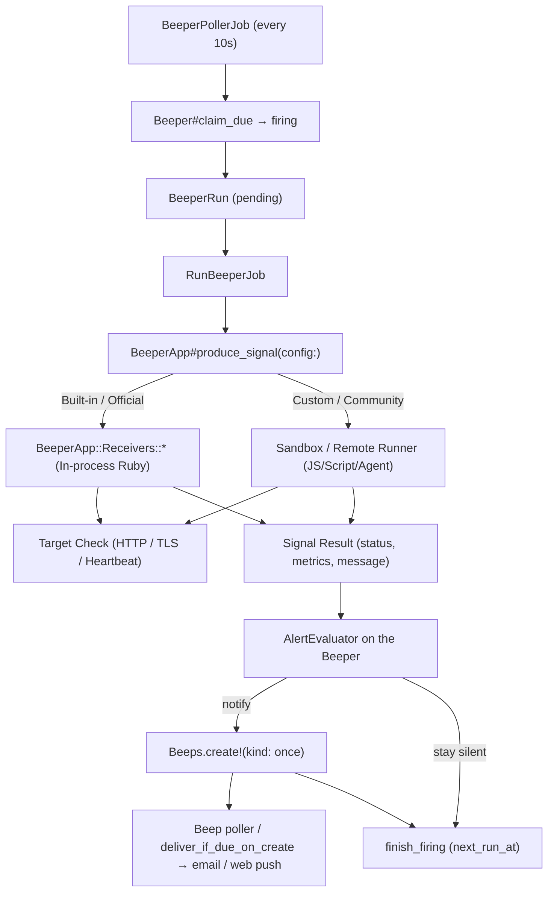

# Beeper

A **Beeper App** is a catalog definition (manifest + receiver). A **Beeper** is an account-owned running instance of that Beeper App: config, cron, alert state, and default channels. When the alert state machine says to notify, the Beeper creates a one-shot **Beep**. Beep is only the notification; it never produces a signal.

Terms: [`TERMS.md`](../TERMS.md). Remaining work lives in [`TODO.md`](../../TODO.md), not here.



---

## Decisions

These four are load-bearing; everything below follows from them.

**1. Beep `kind` stays `once | recurring` and is only the notification recurrence axis.** It does not mean “this row is a monitor.” User-created reminders stay `once` or `recurring`. Beeper-generated Beeps are always `kind: once`. Beeper cron lives on the Beeper, never on that Beep.

**2. Probe outcome lives on `beeper_runs`, delivery outcome on `beep_runs`.** `beeper_runs.signal_status` (`ok` / `alerting` / `error`) is the signal result. `beep_runs.status` (`pending running succeeded failed …`) means *did we deliver*. A healthy probe that creates no Beep is not a skipped or failed delivery.

**3. Notification is a decision on the Beeper; a notify creates a new once Beep.** The alert state machine (`AlertEvaluator`) runs against the Beeper. `should_notify` → `Beeps.create!(kind: once, …)` with channels copied onto the Beep and optional `beeper_id` so the inbox can point back at the Beeper. Delivery then uses the existing Beep path. One notify event → one Beep → N channel types on that Beep (same BeepRun). A 5-minute schedule does not email every 5 minutes for the whole outage.

**4. Signal production is unified behind `BeeperApp#produce_signal`.** Built-in official receivers (`BeeperApp::Receivers::*`) run in-process for low latency and zero external dependencies, while custom or community apps use isolated sandbox/runners. The job and alert evaluation layers only consume the standardized `Signal` contract, remaining completely decoupled from how or where the signal was produced.

---

## Core Data Model & Separation of Concerns

Probe state must **never** live on `beeps` / `beep_runs`. The ecosystem cleanly separates definitions, running instances, probe executions, and notification dispatches:

- **`BeeperApp` (Catalog Definition)**: Manifest contracts and metadata. Official apps are system-level (`account_id: nil`), seeded idempotently from `apps/beepers/*/manifest.json`. Custom apps are scoped to accounts.
- **`Beeper` (Running Monitor Instance)**: Account-owned instance tracking schedule (cron, timezone), user configuration, execution status (`active`, `paused`, `firing`), and alert evaluation state (`alert_state`, `consecutive_failures`).
- **`BeeperRun` (Probe Execution)**: Tracks probe job execution and signal outcomes (`ok`, `alerting`, `error`) with capped signal results.
- **`Beep` & `BeepRun` (Notification Dispatch)**: Standard notification records (`kind: once`) created only when the Beeper alert state machine decides to notify. Standard channel delivery mechanics apply.

---

## Alert state machine

`error` (the signal logic itself broke: DNS blip, timeout, 5xx from a future runner, bad script) is not the same as `alerting` (the target is genuinely bad), but both count toward the threshold so a flapping signal does not spam.

Notify means **create a Beep** (`Beeps.create!(kind: once)`), not deliver from the Beeper Run.

| Previous `alert_state` | `signal_status`      | Notify                            | Next state                                      |
| ---------------------- | -------------------- | --------------------------------- | ----------------------------------------------- |
| `ok`                   | `ok`                 | no                                | `ok`, counter 0                                 |
| `ok`                   | `alerting` / `error` | only when counter + 1 ≥ threshold | `alerting` if notified, else `ok` (counter + 1) |
| `alerting`             | `alerting` / `error` | no (already alerting)             | `alerting`, counter + 1                         |
| `alerting`             | `ok`                 | **yes — recovery**                | `ok`, counter 0                                 |

Threshold comes from the manifest (`failure_threshold`, default 2) and is user-overridable. Created Beep copy distinguishes "target is failing" from "the signal could not be produced"; a Beeper with many consecutive `error` results is surfaced as broken in the UI rather than reported as an outage.

`EXPIRED_AFTER = 1.hour` applies to Beepers: a probe result an hour late is worthless, so an expired Beeper Run is dropped without evaluating or notifying. Reminder Beeps keep today's late-is-better-than-never behaviour.

---

## Signal Execution Abstraction & Contract

Signal evaluation is decoupled from execution environment through `BeeperApp#produce_signal(config:)`:

```ruby
# Standard Signal Data Contract:
BeeperApp::Signal = Data.define(:status, :title, :message, :metrics)
# - status:  :ok | :alerting | :error
# - title:   Short human-readable summary (e.g. "example.com is operational")
# - message: Detailed diagnostic or error description
# - metrics: Hash of key-value numbers/units declared in the manifest (e.g. { "latency_ms" => 42, "status" => 200 })
```

### Input Contract
- **`config`**: Validated user configuration input dictionary (`Hash<String, Any>`) merged with runtime metadata (e.g., `last_ping_at`, `ping_token` for webhooks).

### Output Contract
A `BeeperApp::Signal` instance representing one of three canonical states:
1. **`:ok`**: Target health is nominal according to probe assertions.
2. **`:alerting`**: Target failed health assertions (e.g., HTTP 500, TLS certificate expiring soon, heartbeat missed).
3. **`:error`**: Probe infrastructure or probe execution failed (e.g., DNS resolution error, SSRF block, timeout, runtime exception).

### Execution Seam
- **Built-in Official Receivers**: Implemented under `BeeperApp::Receivers::* < BeeperApp::Receivers::Base`, executing in-process Ruby with SSRF IP-pinning.
- **Custom / Third-party Apps**: Dispatched to isolated sandbox / remote workers with network namespace boundaries and CPU/memory limits.

All application jobs use the `default` queue. `solid_queue_recurring` is reserved for Solid Queue's own recurring scheduler (`config/recurring.yml`).

---

## Manifest Contract & Extensibility

The manifest defines the contract between the Beeper catalog and the system runtime:

- **Identity & Versioning**: Uniquely identified by `slug` and semver `version`, with `manifest_version` ensuring forward compatibility across iterations.
- **Dynamic Configuration Form**: `inputs` specify fields (type, validations, defaults, options) used by the web UI to dynamically render installation and configuration forms.
- **Observability Declarations**: `metrics` declare structured numerical/status outputs that the probe produces for visualization and alerting.
- **Schedule & Ingest Rules**: Dictates default execution frequency, minimum intervals, failure alert thresholds, and ingest modes (e.g. webhook ping tokens for Heartbeat).

Validation is enforced during catalog sync or custom app upload to ensure data integrity.

---

## Built-in beepers

| Beeper App         | Trigger                 | Implementation                                           |
| ------------------ | ----------------------- | -------------------------------------------------------- |
| Site Uptime        | schedule                | `Net::HTTP`; asserts status code, records latency        |
| SSL / TLS expiry   | schedule                | `OpenSSL::SSL` peer cert; alerts under N days remaining  |
| Heartbeat (Snitch) | schedule + inbound ping | Reads `last_ping_at`; alerts when the window is exceeded |

Heartbeat is not an outbound probe. It fits the same interface: the inbound `POST /ping/:token` endpoint only stamps `last_ping_at` on the Beeper, and the *scheduled* probe evaluates staleness locally. That endpoint is public and unauthenticated by nature (that is the product), so it needs rate limiting per token, an opaque high-entropy token, and no response body that leaks account information.

---

## Security

**SSRF is the main exposure** — `target_url` is user-supplied and the Ruby receiver fetches it, sandbox or not. Without egress control, receivers become a proxy into our own network and to the cloud metadata endpoint (`169.254.169.254`).

In-process (official receivers):

- Reuse the `SsrfProtection` concept: resolve the host, reject private / link-local / loopback ranges, then **pin the resolved IP** on connect. A resolve-then-fetch pre-check alone is defeated by DNS rebinding.
- Cap redirects (and re-validate each hop), response body size, and total time.
- No custom scripts. The only code executed is ours.

When custom JS arrives, isolation is a hard boundary rather than defence in depth: egress allowlist enforced at the network layer (separate namespace or proxy, not just DNS checks), authenticated and non-internet-reachable runner endpoint (shared secret or mTLS), per-isolate memory and CPU caps, 8 KB output cap enforced runner-side, and per-account concurrency and quota limits.

---

## Capacity

A 5-minute schedule produces ~8,640 `beeper_runs` rows per month **per Beeper**. Probe volume belongs on `beeper_runs`, not on `beep_runs`. Notification Beeps stay sparse (threshold crossings and recoveries).

Retention, per-account Beeper quotas, and signal concurrency limits are needed before public sign-up; they are non-goals of this split.

---

## Open questions / non-goals

This period does **not** ship: a JS sandbox, a community catalog, channel destinations other than the account owner, config `encrypts`, `min_interval_seconds` enforcement, `schedule_offset` jitter, retention jobs, or quotas.

Still open:

- **One runner protocol or two.** [`TODO.md`](../../TODO.md) plans a self-hosted Runner / Agent with registration, token auth, heartbeat, task pull and result reporting. A sandbox runner is the same job with a different protocol (synchronous push). Is the managed beeper runner just the hosted deployment of that Runner? If so the protocol should be designed once, pull-based, before either is built.
- **Engine choice must be single.** "Deno / QuickJS" is not a decision: `fetch` and `AbortSignal.timeout` are Deno; QuickJS has no fetch, no TLS and no async I/O without host functions. Deno also has no per-isolate memory cap without `--v8-flags` or a process per execution — the mechanism needs stating.
- Whether to add a JSON-Schema gem for manifest validation (needs sign-off per [`AGENTS.md`](../../AGENTS.md)).
- Whether Beeper alerts should reach non-owner members before reminder Beeps do.

## Do not

Add `plugin` or a monitor kind to `Beep#kind`; put alert state, ping token, or signal outcome on `beeps` / `beep_runs`; overload `beep_runs.status` with probe outcome; reuse `status: firing` for alert state; build a JS sandbox to execute first-party code; ship custom scripts before the isolation requirements above are met.

