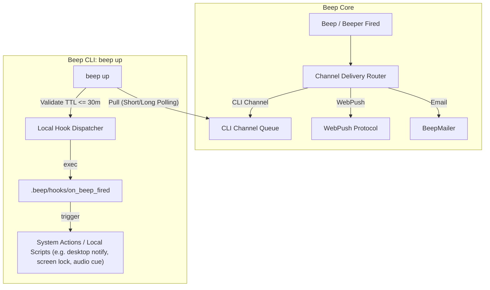

# Notification Channel System

The **Channel** system is Beep's notification delivery infrastructure. A Channel is one user-owned destination row. Kinds today: CLI (`beep up`), [Web Push](web-push.md), email, and webhook. Terms: [`TERMS.md`](../TERMS.md).

---

## 1. System Architecture



---

## 2. Core Decisions

1. **User-scoped ownership**: Channels belong to a `User` (`belongs_to :user`, `belongs_to :account`). A Beep, including on a team account, targets only that user's Channels. Team is the tenant, not a fan-out of members' destinations.
2. **Pull-only HTTP transport**: CLI Channels connect outbound via HTTP polling / long-polling (`beep up`). Zero open ports, zero firewall config. Resilient to sleep/wake, network switches, and server restarts.
3. **Declarative local hooks**: Core transmits structured event payloads only (`event: "beep.fired"`, metadata). The local host controls execution via `$WORKSPACE/.beep/hooks/on_beep_fired`.
4. **TTL safety window**: Notification payloads carry an `expires_at` cutoff (default 30m TTL). Stale events pulled after waking from sleep skip disruptive actions (e.g. screen blanking / locking).

---

## 3. Data model

- **`channels`**: `account_id`, `user_id`, `kind` (`cli`, `email`, `web_push`, `webhook`), `name`, `token` (CLI token / `beep_ct_`), `status` (`active`, `disabled`), `last_seen_at`.
- **`channel_deliveries`**: `beep_run_id`, `channel_id`, `status` (`pending` → `claimed` → `succeeded` / `failed` / `expired`), `payload` (JSON), `expires_at`.

---

## 4. CLI Delivery & Action Protocol

### Event Payload Schema
```json
{
  "id": "del_01j7abc123",
  "event": "beep.fired",
  "source": "runner_job",
  "source_type": "Runner::Job",
  "source_id": "03guanm47qmcg5i3srht9ppps",
  "intent": "get_off_work",
  "beep_id": "03guanm47qmcg5i3srht9ppps",
  "title": "下班啦",
  "body": "今日打卡时间 09:12，已满 9 小时，准备下班！",
  "scheduled_for": "2026-09-10T18:12:00+08:00",
  "expires_at": "2026-09-10T18:42:00+08:00",
  "metadata": {
    "first_checkin_time": "09:12:30"
  }
}
```

### Local Hook (`.beep/hooks/on_beep_fired`)
When `beep up` pulls a pending delivery, it executes `$WORKSPACE/.beep/hooks/on_beep_fired` (with fallback to `on_beep`) with environment variables:
- `BEEP_EVENT`: Event type string (e.g. `beep.fired`).
- `BEEP_EVENT_SOURCE`: Origin source slug (`runner_job`, `beeper`, `beep`).
- `BEEP_EVENT_SOURCE_TYPE`: Polymorphic origin class (e.g. `Runner::Job`, `Beeper`, or empty).
- `BEEP_EVENT_SOURCE_ID`: Unique ID of the trigger source.
- `BEEP_EVENT_INTENT`: Business intent tag (e.g. `get_off_work`, `alert`, `recovery`, `reminder`).
- `BEEP_EVENT_JSON`: Complete event payload JSON string.
- `BEEP_EVENT_ID`: Unique delivery ID.
- `BEEP_EVENT_TITLE`: Notification title.
- `BEEP_EVENT_ACTION_HINT`: Legacy fallback action hint (if present in metadata).

```bash
#!/usr/bin/env bash
set -euo pipefail

# Route by trigger source and intent
case "${BEEP_EVENT_SOURCE:-beep}" in
  runner_job)
    if [[ "${BEEP_EVENT_INTENT:-}" == "get_off_work" ]]; then
      echo "[on_beep_fired] Triggering offwork local action..."
      ~/.local/bin/offwork-action.sh &
    fi
    ;;
  beeper)
    echo "[on_beep_fired] Beeper alert/recovery received: $BEEP_EVENT_TITLE"
    ;;
  beep)
    echo "[on_beep_fired] Standard reminder: $BEEP_EVENT_TITLE"
    ;;
esac
```

---

## 5. Example End-to-End Workflow: `get-off-work`

> [!NOTE]
> **Example Scenario**: The following walkthrough illustrates a concrete end-to-end example where a scheduled job sets up a dynamic notification, which is then routed via Channels and executed locally by the CLI hook.

1. **Morning fetch (09:30 Cloud Job)**: Runs `.beep/jobs/get-off-work`, queries external attendance data for `firstCheckinTime` (`09:12:30`), calculates off-work time (`18:12:30`), and creates a `once` Beep scheduled for `18:12:30` targeting the user's CLI Channel (`my-laptop`) and Web Push Channels.
2. **Due trigger (18:12:30 Core Scheduler)**: `Beep.poll_due_now` fires and creates `channel_deliveries` with `expires_at = 18:42:30`.
3. **Local execution (Host PC)**: `beep up` pulls the delivery, checks `expires_at >= Time.now`, and runs `.beep/hooks/on_beep_fired` → executes the configured local script or system action (e.g. desktop notification, screen lock/blank, audio cue), then ACKs the delivery.

---

## 6. Future / Multi-Platform Roadmap

The primary motivation for establishing the **Channel** abstraction is extensibility: the core scheduling engine remains completely platform-agnostic, while new notification targets and client endpoints can be plugged in as first-class adapters:

- **Mobile** (`kind=ios` / `kind=android`, planned):
  - **iOS**: Native APNs Push, Live Activities, and critical alerts.
  - **Android**: FCM / UnifiedPush / local background services.
- **Desktop** (`kind=desktop`, planned; not Beep CLI / `beep up`):
  - Native apps: macOS Menu Bar, Windows Tray, Linux App (Omarchy GUI).
- **Third-Party Integrations**:
  - **Team Chat Webhooks**: Lark / Feishu, DingTalk, WeCom, Slack, Discord, Telegram bots.
- **Bi-directional Remote Actions**:
  - Extend delivery payloads with interactive action callbacks (e.g. snooze 10m, dismiss, trigger remote probe).
