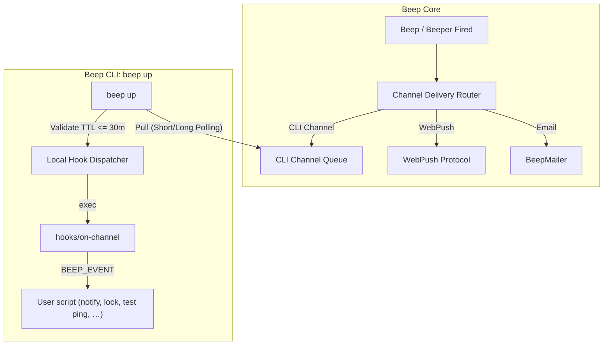

# Notification Channel System

The **Channel** system is Beep's notification delivery infrastructure. A Channel is one user-owned destination row. Kinds today: CLI (`beep up`), [Web Push](web-push.md), and email (webhook is planned, not implemented yet). Terms: [`TERMS.md`](../TERMS.md).

---

## 1. System Architecture



---

## 2. Core Decisions

1. **User-scoped ownership**: Channels belong to a `User` (`belongs_to :user`, `belongs_to :account`). A Beep, including on a team account, targets only that user's Channels. Team is the tenant, not a fan-out of members' destinations.
2. **Pull-only HTTP transport**: CLI Channels connect outbound via HTTP polling / long-polling (`beep up`). Zero open ports, zero firewall config. Resilient to sleep/wake, network switches, and server restarts.
3. **Declarative local hooks**: Core transmits structured event payloads only. Every CLI inbox delivery — Beep (`beep.fired`) or channel test (`channel.test`) — runs the same `$WORKSPACE/hooks/on-channel`. The script branches on `BEEP_EVENT`. The CLI does not send OS desktop notifications itself.
4. **TTL safety window**: Notification payloads carry an `expires_at` cutoff (default 30m TTL). Stale events pulled after waking from sleep skip disruptive actions (e.g. screen blanking / locking).

---

## 3. Architecture & Data Model

### Class Hierarchy & Separation
- **`Channel` (`core/app/models/channel.rb`)**: Core destination entity (`account_id`, `user_id`, `kind`, `name`, `token`, `status`, `config`). Delegates delivery and validation to strategy handlers via `Channel#handler`.
- **`Channel::Handlers::*` (`core/app/models/channel/handlers/`)**: Protocol adapters implementing delivery and validation (`Handlers::Cli`, `Handlers::Email`, `Handlers::WebPush`, `Handlers::Webhook`).
- **`Channel::Authorization` (`core/app/models/channel/authorization.rb`)**: RFC 8628 Device Authorization pairing records.
- **`Channel::Delivery` (`core/app/models/channel/delivery.rb`)**: Delivery status and inbox pull queue records.

### Database Tables
- **`channels`**: `account_id`, `user_id`, `kind` (`cli`, `email`, `web_push`; `webhook` planned, not implemented), `name`, `token` (CLI token / `beep_ct_`), `status` (`active`, `disabled`), `config`, `last_seen_at`.
- **`channel_authorizations`**: `account_id`, `user_id`, `channel_id`, `device_code`, `user_code`, `channel_name`, `status` (`pending`, `approved`, `access_denied`, `expired`), `expires_at`, `last_polled_at` (RFC 8628 OAuth 2.0 Device Flow).
- **`channel_deliveries`**: `beep_run_id`, `channel_id`, `status` (`pending` → `claimed` → `succeeded` / `failed` / `expired`), `payload` (JSON), `expires_at`.

---

## 4. CLI Channel Connection & Device Flow (RFC 8628)

Beep CLI supports instant authentication and Channel token binding via the standard **OAuth 2.0 Device Authorization Grant ([RFC 8628](https://www.rfc-editor.org/info/rfc8628/))**:

```bash
# Connect the current workspace to your Beep user account
beep channel connect

# Disconnect and clear CLI token from workspace config
beep channel disconnect
```

1. **`beep channel connect`**:
   - Requests a device authorization session from Core (`POST /api/v1/channels/cli/authorizations`).
   - Receives a user code (`WDJB-MJHT`) and verification URL (`http://web.../device?code=WDJB-MJHT`).
   - Auto-opens the default browser and enters token polling loop (`POST /api/v1/channels/cli/authorizations/token`).
2. **Web Authorization (`/device`)**:
   - User verifies code (`GET /api/v1/channels/cli/authorizations/:user_code`), confirms/renames device name (defaulted from hostname), and clicks "Authorize" (`PATCH /api/v1/channels/cli/authorizations/:user_code`).
   - Backend creates a new CLI Channel row under the user's personal account and approves the authorization.
3. **Workspace Persistence**:
   - CLI receives `access_token` (`beep_ct_...`) and persists it into `$WORKSPACE/config.json` (`cli_token`).


---

## 5. CLI Delivery & Action Protocol

### Event Payload Schema
```json
{
  "id": "del_01j7abc123",
  "event": "beep.fired",
  "source": "runner_job",
  "source_type": "Runner::Job",
  "source_id": "03guanm47qmcg5i3srht9ppps",
  "intent": "get_off_work",
  "beep_id": "03guanm47qmcg5i3srht9ppps",
  "title": "下班啦",
  "body": "今日打卡时间 09:12，已满 9 小时，准备下班！",
  "scheduled_for": "2026-09-10T18:12:00+08:00",
  "expires_at": "2026-09-10T18:42:00+08:00",
  "metadata": {
    "first_checkin_time": "09:12:30"
  }
}
```

### Local Hook (`hooks/on-channel`)
When `beep up` pulls a pending delivery it execs **one** file: `$WORKSPACE/hooks/on-channel` (also `$WORKSPACE/.beep/hooks/on-channel`). Beep and channel test share this callback because both arrive as `ChannelDelivery` on the CLI inbox. Branch on `BEEP_EVENT` in the script.

Missing hook: log and ACK success. Hook non-zero exit: ACK failed.

Environment variables:
- `BEEP_EVENT`: Event type string (e.g. `beep.fired`, `channel.test`).
- `BEEP_EVENT_SOURCE`: Origin source slug (`runner_job`, `beeper`, `beep`).
- `BEEP_EVENT_SOURCE_TYPE`: Polymorphic origin class (e.g. `Runner::Job`, `Beeper`, or empty).
- `BEEP_EVENT_SOURCE_ID`: Unique ID of the trigger source.
- `BEEP_EVENT_INTENT`: Optional free-form tag you set (example: `get_off_work`).
- `BEEP_EVENT_JSON`: Complete event payload JSON string.
- `BEEP_EVENT_ID`: Unique delivery ID.
- `BEEP_EVENT_TITLE`: Notification title.

Workspace `.env` and `.env.local` are loaded into the hook process the same way as runner jobs: missing files are skipped; `.env.local` overrides `.env`; a file that exists but cannot be read fails the hook. Delivery `BEEP_EVENT_*` vars are set last.

```bash
#!/usr/bin/env bash
# hooks/on-channel — every CLI channel delivery
set -euo pipefail

case "${BEEP_EVENT:-}" in
  channel.test)
    echo "[on-channel] channel test OK: $BEEP_EVENT_TITLE"
    ;;
  beep.*)
    case "${BEEP_EVENT_SOURCE:-beep}" in
      runner_job)
        if [[ "${BEEP_EVENT_INTENT:-}" == "get_off_work" ]]; then
          echo "[on-channel] Triggering offwork local action..."
          ~/.local/bin/offwork-action.sh &
        fi
        ;;
      beeper)
        echo "[on-channel] Beeper alert/recovery received: $BEEP_EVENT_TITLE"
        ;;
      *)
        echo "[on-channel] Standard reminder: $BEEP_EVENT_TITLE"
        ;;
    esac
    ;;
esac
```

---

## 6. Example End-to-End Workflow: `get-off-work`

> [!NOTE]
> **Example Scenario**: The following walkthrough illustrates a concrete end-to-end example where a scheduled job sets up a dynamic notification, which is then routed via Channels and executed locally by the CLI hook.

1. **Morning fetch (09:30 Cloud Job)**: Runs `.beep/jobs/get-off-work`, queries external attendance data for `firstCheckinTime` (`09:12:30`), calculates off-work time (`18:12:30`), and creates a `once` Beep scheduled for `18:12:30` targeting the user's CLI Channel (`my-laptop`) and Web Push Channels.
2. **Due trigger (18:12:30 Core Scheduler)**: `Beep.poll_due_now` fires and creates `channel_deliveries` with `expires_at = 18:42:30`.
3. **Local execution (Host PC)**: `beep up` pulls the delivery, checks `expires_at >= Time.now`, and runs `hooks/on-channel` → the user's local script (branch on `BEEP_EVENT`; e.g. desktop notification, screen lock/blank, audio cue), then ACKs the delivery.

---

## 7. Future / Multi-Platform Roadmap

The primary motivation for establishing the **Channel** abstraction is extensibility: the core scheduling engine remains completely platform-agnostic, while new notification targets and client endpoints can be plugged in as first-class adapters:

- **Mobile** (`kind=ios` / `kind=android`, planned):
  - **iOS**: Native APNs Push, Live Activities, and critical alerts.
  - **Android**: FCM / UnifiedPush / local background services.
- **Desktop** (`kind=desktop`, planned; not Beep CLI / `beep up`):
  - Native apps: macOS Menu Bar, Windows Tray, Linux App (Omarchy GUI).
- **Third-Party Integrations**:
  - **Team Chat Webhooks**: Lark / Feishu, DingTalk, WeCom, Slack, Discord, Telegram bots.
- **Bi-directional Remote Actions**:
  - Extend delivery payloads with interactive action callbacks (e.g. snooze 10m, dismiss, trigger remote probe).
