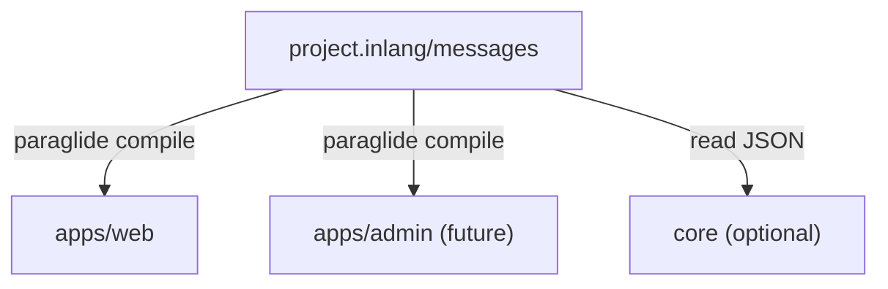

# Locale

UI copy uses [Paraglide JS](https://inlang.com/m/gerre34r/library-inlang-paraglideJs). One shared inlang project holds messages; each frontend app compiles its own Paraglide runtime. There is no shared runtime dictionary package.



## Source vs runtime

| Layer    | Role                                                                 |
| -------- | -------------------------------------------------------------------- |
| **Source** | `project.inlang/` — message JSON and locale settings; edit copy here |
| **Runtime** | Per-app Paraglide output — typed `m.*()` functions; generated, gitignored |
| **Tooling** | `pnpm locale:sort` / `locale:check` — key order and en/zh parity   |

Paraglide strategy, URL prefixing, SSR middleware, and cookie handling are **app-owned**. Do not share compiled output across apps in `packages/`.

Non-Paraglide consumers (e.g. Rails) may read the same JSON or keep a separate format; `project.inlang/messages/` is still the canonical UI message source.

## Locales

- Base: `en` — URLs unprefixed (`/$account_slug/beeps`)
- Additional: `zh` — URL prefix `/zh/...`
- Web strategy: `url`, `cookie`, `baseLocale`

Locale is resolved on the server via Paraglide middleware; the router rewrites localized URLs through Paraglide runtime helpers.

## Messages

Keys are flat **snake_case** with a namespace prefix (`common_save`, `admin_jobs`). Paraglide maps each key to a typed function:

```ts
import { m } from "@/locale/paraglide/messages";

m.common_save();
m.account_pick_account_last_used({ slug: "acme" });
```

Use `{param}` for interpolation. Some values are JSON-encoded strings (e.g. lists); parse them in app helpers when needed.

## Usage

**Copy in components** — import `m` from the app’s Paraglide messages module.

**Locale + routing** — `getLocale`, `setLocale`, `localizeHref`, `deLocalizeHref` from Paraglide runtime (web re-exports common pieces from `@/lib/locale`).

**Switch language** — update locale via Paraglide runtime and navigate to the localized URL; do not maintain a parallel React i18n context.

Dev and production builds compile messages through the Paraglide Vite plugin; manual `pnpm locale:compile` is only for one-off checks outside Vite.

## Workflow

1. Add the key to **both** `en.json` and `zh.json`.
2. `pnpm locale:sort` then `pnpm locale:check`.
3. Use `m.your_key()` in the app (restart dev or compile if needed).

## New frontend apps

Point Paraglide at the repo-root inlang project, compile into that app’s own output directory, gitignore the output, and pick strategy/routing for the platform. Shared UI packages should receive translated strings from the app layer, not compile Paraglide themselves.

## Boundaries

- One message source — no duplicate JSON or TS dictionaries.
- Generated Paraglide output is read-only.
- Do not recreate a shared `@beep/locales`-style runtime package for Paraglide apps.
