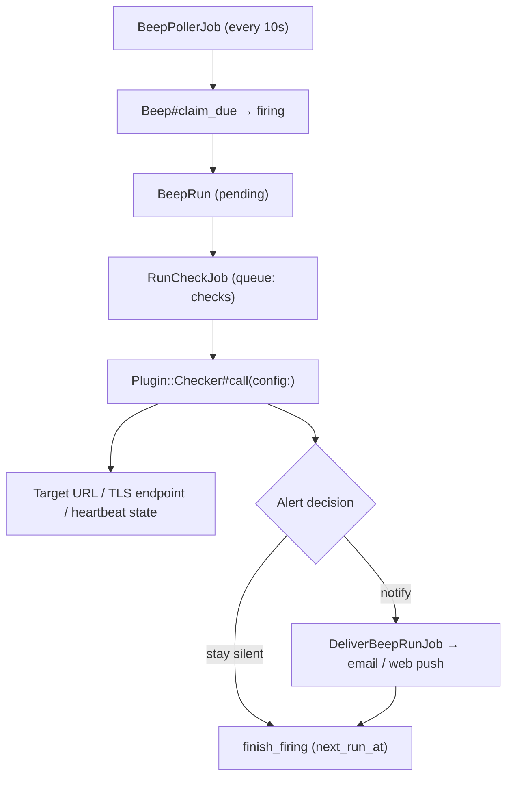

# Plugin Ecosystem

A **Plugin** turns a Beep into a monitor: instead of firing a fixed message on schedule, the Beep runs a **Check** and only notifies when the Check says something is wrong. Scheduling (`BeepPollerJob` → `claim_due` → `BeepRun`) and delivery (email / web push) are reused unchanged.

Terms: [`TERMS.md`](../TERMS.md). New vocabulary below; add it there when PR 1 lands.

| Term        | Meaning                                                                              |
| ----------- | ------------------------------------------------------------------------------------ |
| Plugin      | A check definition: manifest + implementation. Official (seeded) or custom.          |
| Check       | One execution of a Plugin against user config. Produces `ok` / `alerting` / `error`. |
| Alert state | Whether a plugin Beep is currently `ok` or `alerting`. Lives on the Beep.            |
| Threshold   | Consecutive non-`ok` Checks required before the first notification.                  |



---

## Decisions

These four are load-bearing; everything below follows from them.

**1. `kind` stays `once | recurring`.** It is the recurrence axis, and every branch in `Beep` is a two-way `once? / recurring?` split. A third value would fall through `sync_run_attributes` (leaving `next_run_at` nil, so the poller never sees the Beep) and through `calculate_next_run_at` (so `finish_firing` never reschedules it) — silently, with no validation error. A plugin Beep is a `recurring` Beep with `plugin_id` present. Cron, timezone, pause / resume and rescheduling are then reused with zero model changes.

**2. Check outcome is separate from delivery outcome.** `beep_runs.status` (`pending running succeeded failed …`) means *did we deliver*. A healthy check that intentionally sends nothing is not `skipped` and not `failed`. Checks write their own `check_status`.

**3. Notification is a decision, not a side effect.** Today `BeepRun#deliver_now` always delivers. For plugin Beeps delivery is gated by the alert state machine, so a 5-minute check does not email every 5 minutes for the whole outage.

**4. Phase 1 runs first-party Ruby in-process. No JS sandbox, no new service.** The sandbox exists to run *untrusted* code, which is Phase 3. Site Uptime and SSL expiry are ~30 lines each of `Net::HTTP` / `OpenSSL`. Building a Deno service, image, CI pipeline and RPC protocol to execute code we wrote ourselves buys isolation we do not need yet and costs a new deployable (`compose.yml` has three services today). The `Plugin::Checker` interface is the seam: swapping in a sandboxed runner later is an implementation change behind it, not a refactor.

---

## Data model

Plugin **definition** and plugin **installation** are different records. Putting JS source on the Beep row (as an earlier draft did) leaves official plugins unversioned, makes updates unable to reach existing installs, and gives the manifest nowhere to live.

### `plugins` (new)

| Column       | Type   | Notes                                                    |
| ------------ | ------ | -------------------------------------------------------- |
| `slug`       | string | `site-uptime`. Unique per owner.                         |
| `account_id` | uuid   | `nil` = official. Set = custom, private to that account. |
| `version`    | string | Semver from the manifest.                                |
| `manifest`   | jsonb  | Validated against the contract on write.                 |
| `source`     | text   | Phase 3 only. Null for official checkers (Ruby classes). |

Official rows are seeded from `apps/plugins/*/manifest.json` (or `apps/plugins/`); the seed is idempotent on `(slug, version)`.

### `beeps` (extend)

| Column                 | Type     | Notes                                                                  |
| ---------------------- | -------- | ---------------------------------------------------------------------- |
| `plugin_id`            | uuid     | Nullable FK. **Presence is what makes a Beep a plugin Beep.**          |
| `plugin_config`        | jsonb    | User answers to `inputs`. `encrypts` — inputs may be API tokens.       |
| `alert_state`          | string   | `ok` \| `alerting`. Default `ok`.                                      |
| `consecutive_failures` | integer  | Default 0. Reset on `ok`.                                              |
| `schedule_offset`      | integer  | Seconds, derived from `id`. Spreads a shared `*/5 * * * *` default.    |
| `ping_token`           | string   | Unique, nullable. Issued only when the manifest sets `ingest.webhook`. |
| `last_ping_at`         | datetime | Nullable. Stamped by the ping endpoint, read by the Heartbeat check.   |

`title` is the monitor name the user typed (`example.com availability`) and keeps its `presence: true` validation. `body` is unused for plugin Beeps.

Do not reuse `Beep#status`'s existing `firing` value for alerting — there it means *delivery in flight*. `alert_state` is a separate column on purpose.

### `beep_runs` (extend)

| Column         | Type   | Notes                                                                |
| -------------- | ------ | -------------------------------------------------------------------- |
| `check_status` | string | `nil` for reminders. `ok` \| `alerting` \| `error`.                  |
| `check_result` | jsonb  | `{ title, message, metrics, log }`. **Capped at 8 KB** before write. |

The existing `result` json column stays as-is for per-channel delivery metadata. Two JSON columns with clean, disjoint meanings — not three overlapping ones.

---

## Alert state machine

`error` (the check itself broke: DNS blip, timeout, 5xx from a future runner, bad script) is not the same as `alerting` (the target is genuinely bad), but both count toward the threshold so a flapping check does not spam.

| Previous `alert_state` | `check_status`       | Notify                            | Next state                                      |
| ---------------------- | -------------------- | --------------------------------- | ----------------------------------------------- |
| `ok`                   | `ok`                 | no                                | `ok`, counter 0                                 |
| `ok`                   | `alerting` / `error` | only when counter + 1 ≥ threshold | `alerting` if notified, else `ok` (counter + 1) |
| `alerting`             | `alerting` / `error` | no (already alerting)             | `alerting`, counter + 1                         |
| `alerting`             | `ok`                 | **yes — recovery**                | `ok`, counter 0                                 |

Threshold comes from the manifest (`failure_threshold`, default 2) and is user-overridable. Delivered copy distinguishes "target is failing" from "the check could not run"; a Beep with many consecutive `error` results is surfaced as broken in the UI rather than reported as an outage.

`push_payload` becomes run-aware (`push_payload(run:)`): use the Check's `title` / `message` when present, fall back to `beep.title` / `body`. Recipients stay `account.owner_user` — team fan-out is out of scope here, same as for reminders.

`EXPIRED_AFTER = 1.hour` is inverted for monitoring: a probe result an hour late is worthless, so an expired plugin run is dropped without evaluating or notifying. Reminders keep today's late-is-better-than-never behaviour.

---

## Checker interface

```ruby
# Plugin::CheckResult = Data.define(:status, :title, :message, :metrics)
#   status: :ok | :alerting | :error

class Plugin::Checkers::SiteUptime
  def call(config:)
    # → Plugin::CheckResult
  end
end
```

Checks run on their own Solid Queue queue (`checks`), never on `default`. A slow target must not delay reminder delivery — reminders are the core product, and `queue.yml` already runs separate workers.

---

## Manifest contract

```json
{
  "manifest_version": 1,
  "slug": "site-uptime",
  "name": "Site Uptime & Health Check",
  "version": "1.0.0",
  "description": "HTTP status and latency probe",
  "author": "Beep Official",
  "schedule": {
    "default_cron": "*/5 * * * *",
    "min_interval_seconds": 60,
    "failure_threshold": 2
  },
  "ingest": { "webhook": false },
  "inputs": [
    { "name": "target_url",      "label": "Target URL", "type": "url",     "required": true },
    { "name": "expected_status", "label": "Expected status", "type": "number", "default": 200, "min": 100, "max": 599 },
    { "name": "timeout_ms",      "label": "Timeout (ms)", "type": "number", "default": 3000, "max": 10000 }
  ],
  "metrics": [
    { "name": "latency_ms", "label": "Latency", "type": "number", "unit": "ms" },
    { "name": "status",     "label": "HTTP status", "type": "number" }
  ]
}
```

- **`manifest_version`** is mandatory. Third-party plugins are an explicit goal, so forward compatibility has to exist before the first plugin ships.
- **`inputs[].type`** is `string | number | boolean | url | enum | secret`. `secret` inputs are masked in the UI and are why `plugin_config` is encrypted. `enum` carries `options`. Validation keys: `required`, `min`, `max`, `pattern`. Phase 2 generates forms from this, so the schema must be rich enough now — widening it later is a breaking change for installed plugins.
- **`metrics`** must be declared. Charting latency over time needs names, types and units up front.
- **`min_interval_seconds`** is enforced by comparing two consecutive `Fugit#next_time` values against it, rejecting the cron otherwise.
- **`ingest.webhook`** grants the Beep a ping token (see Heartbeat below).
- **`schedule.default_cron`** is a starting point only; `schedule_offset` spreads installs so every account does not fire at `:00` / `:05`.

Manifest validation is hand-rolled against this fixed shape. Adding a JSON-Schema gem is an open question, not a decision.

---

## Built-in plugins

| Plugin             | Trigger                 | Implementation                                           |
| ------------------ | ----------------------- | -------------------------------------------------------- |
| Site Uptime        | schedule                | `Net::HTTP`; asserts status code, records latency        |
| SSL / TLS expiry   | schedule                | `OpenSSL::SSL` peer cert; alerts under N days remaining  |
| Heartbeat (Snitch) | schedule + inbound ping | Reads `last_ping_at`; alerts when the window is exceeded |

Heartbeat is not an outbound probe, which the earlier draft's manifest could not express. It fits the same interface anyway: the inbound `POST /ping/:token` endpoint only stamps `last_ping_at`, and the *scheduled* check evaluates staleness locally. That endpoint is public and unauthenticated by nature (that is the product), so it needs rate limiting per token, an opaque high-entropy token, and no response body that leaks account information.

---

## Security

**SSRF is the main exposure, and it exists in Phase 1 too** — `target_url` is user-supplied and the Ruby checker fetches it, sandbox or not. Without egress control, plugins become a proxy into our own network and to the cloud metadata endpoint (`169.254.169.254`).

Phase 1, in-process:

- Reuse the `SsrfProtection` concept: resolve the host, reject private / link-local / loopback ranges, then **pin the resolved IP** on connect. A resolve-then-fetch pre-check alone is defeated by DNS rebinding.
- Cap redirects (and re-validate each hop), response body size, and total time.
- No custom scripts. The only code executed is ours.

Phase 3, when custom JS arrives, isolation becomes a hard boundary rather than defence in depth, and these become requirements rather than nice-to-haves: egress allowlist enforced at the network layer (separate namespace or proxy, not just DNS checks), authenticated and non-internet-reachable runner endpoint (shared secret or mTLS), per-isolate memory and CPU caps, 8 KB output cap enforced runner-side, and per-account concurrency and quota limits.

---

## Capacity

A 5-minute check produces ~8,640 `beep_runs` rows per month **per Beep**. That table is currently sized for a handful of rows per reminder, so plugin adoption changes its magnitude, not just its content.

- Retention job prunes plugin runs after N days; runs that produced a notification are kept longer.
- `check_result` is capped at 8 KB, so a plugin fetching a large body cannot bloat the database.
- Per-account plugin quota and check concurrency limits are needed before public sign-up; a free tier otherwise allows a thousand 1-minute checks.

---

## Roadmap

### Phase 1 — model and first-party checks

1. **Manifest contract + validator + `plugins` table**, with official seeds in `apps/plugins/`. No execution yet.
2. **Check / alert model end to end**: migrations, `Plugin::Checker` seam, alert state machine, gated delivery, `checks` queue — validated with one trivial checker and its tests.
3. **Site Uptime** with the SSRF guards and response caps above.
4. **SSL / TLS expiry.**
5. **Heartbeat**: ping endpoint with rate limiting + staleness checker.
6. **Retention job** and `schedule_offset` jitter.

### Phase 2 — UI

Plugin list / template gallery, install flow with the form generated from `inputs`, run history with metrics and check logs. Test Run is mostly free: `Beep#trigger_run!` and `POST /api/v1/:slug/beeps/:id/runs` already exist (the TODO item "手动触发测试" is the same work).

### Phase 3 — custom scripts

Sandboxed execution of user JS. Blocked on the open questions below, not scheduled.

---

## Open questions

- **One runner protocol or two.** [`TODO.md`](../../TODO.md) plans a self-hosted Runner / Agent with registration, token auth, heartbeat, task pull and result reporting. A sandbox runner is the same job with a different protocol (synchronous push). Is the managed plugin runner just the hosted deployment of that Runner? If so the protocol should be designed once, pull-based, before either is built.
- **Engine choice must be single.** "Deno / QuickJS" is not a decision: `fetch` and `AbortSignal.timeout` are Deno; QuickJS has no fetch, no TLS and no async I/O without host functions. Deno also has no per-isolate memory cap without `--v8-flags` or a process per execution — the mechanism needs stating.
- Whether to add a JSON-Schema gem for manifest validation (needs sign-off per [`AGENTS.md`](../../AGENTS.md)).
- Whether plugin alerts should reach non-owner members before reminders do.

## Do not

Add `plugin` to `Beep#kind`; overload `beep_runs.status` with check outcome; reuse `Beep#status: firing` for alert state; run checks on the `default` queue; build a JS sandbox to execute first-party code; ship custom scripts before the Phase 3 isolation requirements are met.
