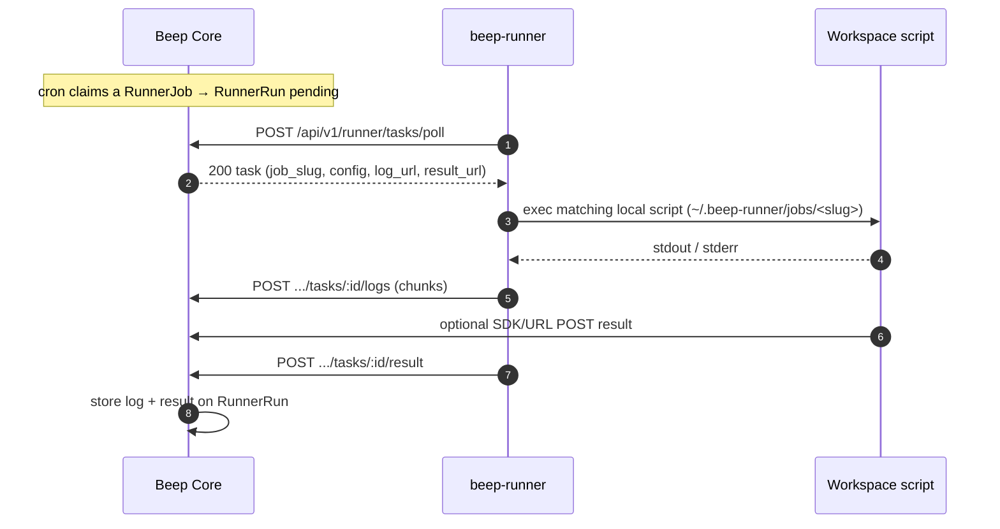

# Self-hosted Runner

A **Runner** is a user-controlled workspace on a machine you operate. Beep Core schedules jobs; the runner polls for due work, runs a **local** script you installed, and posts logs plus a result back to Core.

Official Beeper apps (Site Uptime, SSL expiry, Heartbeat) always execute in Core (cloud). They are not routed to runners. Intranet checks are Runner Jobs whose scripts live on the host.



---

## Decisions

1. **Pull-only HTTP(S).** The runner opens all connections outbound (GitLab Runner style). No inbound ports.
2. **Scripts stay on the host.** Core stores `slug`, cron, timezone, timeout, and optional `config`. The runner resolves `slug` to `~/.beep-runner/jobs/<slug>` (extensionless executable; filename is the slug) or `jobs.json`.
3. **Logs and results are first-class.** Stdout is uploaded while the job runs. Scripts may also POST to `BEEP_LOG_URL` / `BEEP_RESULT_URL` with `X-Runner-Token`. Local execution logs are rotated daily under `logs/beep-runner-YYYY-MM-DD.log`.
4. **User-controlled workspace.** Scripts live on the host. Permissions and executable rights are controlled on the machine by the user.
5. **One runner per workspace**, single instance guaranteed via `.socket`. Concurrent jobs execute via a worker pool. Supports foreground or daemon mode (`-d` / `--daemon`).
6. **Git-style job sync.** Local scripts are the source of truth for execution; Core holds schedule metadata. Slug is the script filename; `@id` survives renames. `job push` / `job pull` / `job list` compare local vs server (pair by slug, then `@id`).

---

## Data model

- **`runners`**: account node, token, last seen, tags (organizational).
- **`runner_jobs`**: name, slug (unique per `runner_id`), cron, timezone, timeout, config, bound to one runner.
- **`runner_runs`**: pending → running → succeeded/failed, `result` JSON, appended `log`.

Jobs can be created or edited from the Web UI (`/$slug/runners/<id>`) or from the CLI. Web edits update Core metadata only; the host still needs a matching local script (create via CLI, `job pull`, or hand-copy).

---

## Workspace & Job Script Metadata

Default workspace: `~/.beep-runner` (override with `--workspace` / `-w` or `BEEP_WORKSPACE`).

```
~/.beep-runner/
  config.json
  jobs.json
  .socket                   # domain socket for single-instance guarantee
  logs/
    beep-runner-2026-09-04.log # daily rotated logs (ANSI stripped)
  jobs/
    intranet-http           # no .sh / .py — filename is the slug
    backup-check
```

Job scripts are **extensionless executables** under `jobs/`. The filename is the slug (`jobs/intranet-http` → `intranet-http`). Runtime is declared by the Unix **shebang** on line 1 (e.g. `#!/usr/bin/env bash`, `node`, `bun`, `python3`, `ruby`, or a custom interpreter); the runner execs the file directly and does not infer language from a suffix. Metadata and schedules live in comments below the shebang:

```bash
#!/usr/bin/env bash
# @id: <server-job-uuid>
# @name: Intranet HTTP Health Check
# @schedule: */5 * * * *
# @timeout: 30s
# @timezone: Asia/Shanghai
# @description: Ping internal gateway

set -euo pipefail
echo "Starting check..."
exit 0
```

Supported comment directives:

| Directive                      | Meaning                                      |
| ------------------------------ | -------------------------------------------- |
| `# @id:` / `// @id:`           | Server job UUID (written after create/push)  |
| `# @name:` / `// @name:`       | Human-readable job name                      |
| `# @schedule:` or `# @cron:`   | Cron expression                              |
| `# @timeout:`                  | Execution timeout (e.g. `30s`, `1m`)         |
| `# @timezone:` / `# @tz:`      | Timezone (e.g. `UTC`, `Asia/Shanghai`)       |
| `# @description:` / `# @desc:` | Job description                              |

### Slug, `@id`, and rename

- **Slug is the filename** (no extension). `jobs/intranet-http` → slug `intranet-http`. The runner resolves a due task’s `job_slug` to that file (or an entry in `jobs.json`).
- There is **no `# @slug:`** header; the path is the source of truth for the slug.
- **Uniqueness** is scoped to one runner: Core enforces unique `(runner_id, slug)`. Two files cannot share a slug in the same workspace either (one path per name).
- **`# @id:`** is the server `runner_jobs` UUID, written after a successful create/push (or pull). It identifies the same job across renames.
- **Rename = slug change.** If you rename the file but keep the same `@id`, local slug and server slug diverge. `job list` still pairs them by `@id` and reports a field-level `slug:` diff (status `modified`). **`job push` sends `@id` with the new slug**; Core updates that same `RunnerJob` (no duplicate). The old slug is freed. If the new slug collides with another job on the same runner, sync fails validation.

### `job list` display and pairing

`job list` compares local workspace jobs to Core (when configured):

| Status        | Meaning                                                                      |
| ------------- | ---------------------------------------------------------------------------- |
| `synced`      | Same slug (or same `@id`) and metadata match                                 |
| `modified`    | Paired, but name / schedule / timezone / timeout / description / slug differ |
| `local only`  | Present locally, not on server                                               |
| `remote only` | Present on server, no local script                                           |

Pairing order: **slug first**, then remaining jobs by **`@id`**. Each listed job shows **cron**, **timezone** (defaults display to `UTC` if unset), and **`@id`** (`(unset)` until synced).

Push / pull interactive multi-select uses the same statuses (gray state suffix). Synced jobs are not pre-selected. Field-level diffs cover name, schedule, timezone, timeout, description, and slug. After a successful create or push, the CLI writes `# @id:` into the local script header.

### CLI (Cobra + interactive Huh)

Interactive TTY prompts (Huh) when args are omitted; use `--no-interactive` for scripts/CI.

```bash
# Configure credentials once (stored in <workspace>/config.json)
beep-runner config set --server https://core.example.com --token beep_rt_xxx
beep-runner config          # show
beep-runner config path     # print config.json path

# Create local scaffold (interactive wizard if slug omitted; syncs to Core unless --no-sync)
beep-runner job create
beep-runner job create intranet-http --cron "*/5 * * * *" --name "Intranet HTTP"

# Push / pull like git (interactive multi-select with sync status when no slug given)
beep-runner job push
beep-runner job push intranet-http
beep-runner job pull
beep-runner job pull --force

# Remove local script (+ server job unless --no-sync)
beep-runner job remove intranet-http

# Compare local vs server (shows tz + id; pairs by slug then @id)
beep-runner job list

# Start daemon (foreground)
beep-runner up

# Start daemon in background
beep-runner up -d
# or: beep-runner -d
```

Command flags for `beep-runner up`:
- `-d, --daemon`: Run runner process in background (daemon mode).
- `-c, --concurrency`: Max concurrent worker jobs (default `5`).
- `-i, --poll-interval`: Task polling interval (default `3s`).

Global flags: `--workspace` / `-w`, `--server`, `--token`, `--no-color`, `--no-interactive`.

Injected env at exec time: `BEEP_SERVER`, `BEEP_RUNNER_TOKEN`, `BEEP_RUN_ID`, `BEEP_JOB_SLUG`, `BEEP_LOG_URL`, `BEEP_RESULT_URL`, `BEEP_CONFIG`, `BEEP_CONFIG_*`.

### Same machine: production + local development

Default workspace stays `~/.beep-runner`. Dev vs prod is normally distinguished by **server URL + token**. If a production runner is already running on the host and you need a second runner pointed at local Core (e.g. testing new runner features), use a separate workspace — never a cwd-relative `./beep-runner-dev`:

```bash
# Production (default workspace)
beep-runner up -d

# Development / feature testing
beep-runner config set -w ~/.beep-runner-dev \
  --server http://core.beep.localhost:3000 --token <dev-token>
beep-runner -w ~/.beep-runner-dev up -d
```

Every dev command must pass `-w ~/.beep-runner-dev` (or set `BEEP_WORKSPACE`), or it will read/write the production `config.json`.

