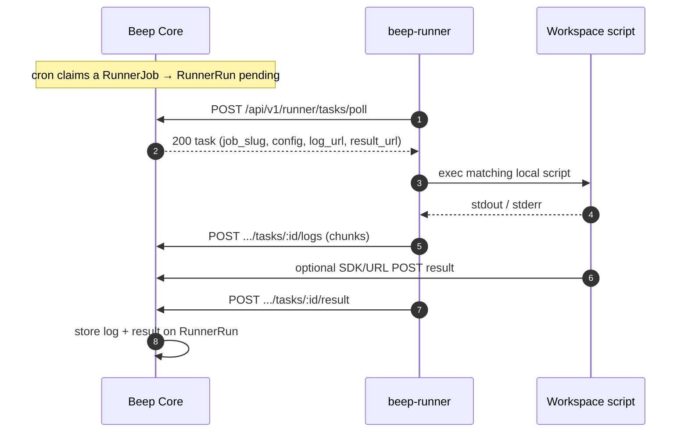

# Self-hosted Runner

A **Runner** is a user-controlled workspace on a machine you operate. Beep Core schedules jobs; the agent polls for due work, runs a **local** script you installed, and posts logs plus a result back to Core.

Official Beeper apps (Site Uptime, SSL expiry, Heartbeat) always execute in Core (cloud). They are not routed to runners. Intranet checks are Runner Jobs whose scripts live on the host.



---

## Decisions

1. **Pull-only HTTP(S).** The agent opens all connections outbound (GitLab Runner style). No inbound ports.
2. **Scripts stay on the host.** Core stores `slug`, cron, timeout, and optional `config`. The agent resolves `slug` to `~/.beep-runner/jobs/<slug>` or `jobs.json`.
3. **Logs and results are first-class.** Stdout is uploaded while the job runs. Scripts may also POST to `BEEP_LOG_URL` / `BEEP_RESULT_URL` with `X-Runner-Token`.
4. **`--allow-exec` is required** to run workspace scripts. Permissions and which files exist are controlled on the machine.
5. **One agent per token / machine**, concurrent jobs via a worker pool.

---

## Data model

- **`runners`**: account node, token, last seen, tags (organizational).
- **`runner_jobs`**: name, slug, cron, timezone, timeout, config, bound to one runner.
- **`runner_runs`**: pending → running → succeeded/failed, `result` JSON, appended `log`.

---

## Workspace

```
~/.beep-runner/
  jobs.json
  jobs/
    intranet-http.sh
```

Examples: [`apps/runner/examples`](../../apps/runner/examples).

```bash
beep-runner run --server https://core.example.com --token beep_rt_xxx --workspace ~/.beep-runner --allow-exec
```

Injected env: `BEEP_SERVER`, `BEEP_RUNNER_TOKEN`, `BEEP_RUN_ID`, `BEEP_JOB_SLUG`, `BEEP_LOG_URL`, `BEEP_RESULT_URL`, `BEEP_CONFIG`, `BEEP_CONFIG_*`.
