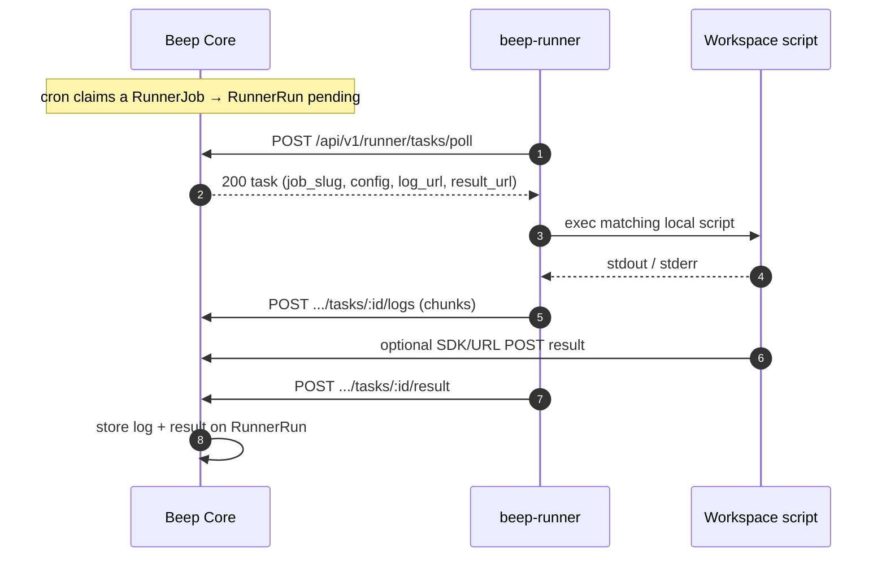

# Self-hosted Runner

A **Runner** is a user-controlled workspace on a machine you operate. Beep Core schedules jobs; the agent polls for due work, runs a **local** script you installed, and posts logs plus a result back to Core.

Official Beeper apps (Site Uptime, SSL expiry, Heartbeat) always execute in Core (cloud). They are not routed to runners. Intranet checks are Runner Jobs whose scripts live on the host.



---

## Decisions

1. **Pull-only HTTP(S).** The agent opens all connections outbound (GitLab Runner style). No inbound ports.
2. **Scripts stay on the host.** Core stores `slug`, cron, timeout, and optional `config`. The agent resolves `slug` to `~/.beep-runner/jobs/<slug>` or `jobs.json`.
3. **Logs and results are first-class.** Stdout is uploaded while the job runs. Scripts may also POST to `BEEP_LOG_URL` / `BEEP_RESULT_URL` with `X-Runner-Token`.
4. **User-controlled workspace.** Scripts live on the host. Permissions and executable rights are controlled on the machine by the user.
5. **One agent per token / machine**, concurrent jobs via a worker pool.

---

## Data model

- **`runners`**: account node, token, last seen, tags (organizational).
- **`runner_jobs`**: name, slug, cron, timezone, timeout, config, bound to one runner.
- **`runner_runs`**: pending → running → succeeded/failed, `result` JSON, appended `log`.

---

## Workspace & Job Script Metadata

```
~/.beep-runner/
  config.json
  jobs.json
  jobs/
    intranet-http.sh
    backup-check.py
```

Job scripts can define metadata and schedules in comments at the top of the file:

```bash
#!/usr/bin/env bash
# @name: Intranet HTTP Health Check
# @schedule: */5 * * * *
# @timeout: 30s
# @description: Ping internal gateway

set -euo pipefail
echo "Starting check..."
exit 0
```

Supported comment directives:
- `# @name:` / `// @name:` — Human-readable job name
- `# @schedule:` or `# @cron:` — Cron expression for scheduling (e.g. `*/5 * * * *`, `0 * * * *`)
- `# @timeout:` — Execution timeout (e.g. `30s`, `1m`)
- `# @timezone:` / `# @tz:` — Timezone (e.g. `UTC`, `Asia/Shanghai`)

### CLI Commands

```bash
# Configure runner credentials and options once
beep-runner config set --server https://core.example.com --token beep_rt_xxx

# Create a local job script and sync to server
beep-runner job create intranet-http --cron "*/5 * * * *"

# Remove a local job script and delete from server
beep-runner job remove intranet-http

# Sync all local workspace scripts to server
beep-runner job sync

# List workspace jobs and server jobs
beep-runner job list

# Start daemon
beep-runner run
```

Injected env: `BEEP_SERVER`, `BEEP_RUNNER_TOKEN`, `BEEP_RUN_ID`, `BEEP_JOB_SLUG`, `BEEP_LOG_URL`, `BEEP_RESULT_URL`, `BEEP_CONFIG`, `BEEP_CONFIG_*`.
