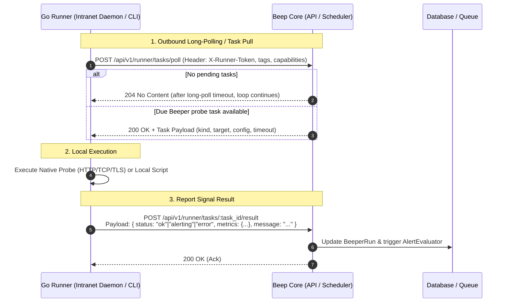

# Self-hosted Runner

A **Self-hosted Runner** (`beep-runner`) is a lightweight, host-resident agent designed to execute private intranet probes (HTTP, TCP, TLS, DNS) and local shell/script checks on-premise. It bridges the gap between the cloud-hosted Beep platform and firewalled internal infrastructure while ensuring sensitive credentials stay local.

Design: Pull-based HTTP(S) protocol, single-tier token authentication, native Go runtime.



---

## Decisions

1. **Outbound-only HTTP(S) Pull model (GitLab Runner style)**: The Runner initiates all network connections outbound to Beep Core. No inbound firewall openings, public IPs, or NAT hole-punching required. Works out of the box with corporate HTTP proxies.
2. **Single-tier static token created in Web UI**: Account owners create a Runner instance in the dashboard (e.g. `Office-Mac-Mini`), obtaining a high-entropy `beep_rt_*` token. Starting the runner requires only setting `BEEP_SERVER` and `BEEP_RUNNER_TOKEN`, providing a zero-local-state, Docker-friendly experience.
3. **One Runner per machine, multi-task concurrent pool**: A single Runner daemon handles any number of assigned Beepers concurrently using Go goroutine worker pools.
4. **Task routing via explicit node binding + optional tags**: Beepers can be assigned to a specific Runner node or routed via matching tags (e.g. `tag:intranet`) across healthy online runners.
5. **Native Go client implementation**: Compiled to a single static binary (~15MB, CGO-free) with minimal memory footprint (<15MB RAM), native cross-compilation across Linux (amd64, arm64, armv7), macOS, and Windows.
6. **Explicit security boundaries for local script execution**: Native network probes run out of the box; local shell/command execution requires the explicit `--allow-exec` opt-in flag. Secrets and environment variables are injected locally without transmitting credentials to the cloud. Output logs are capped at 8 KB.

---

## Core Data Model & Lifecycle

### Database Tables (Core)

- **`runners`**:
  - `account_id`: Associated account.
  - `name`: User-friendly label (e.g. `Prod-Gateway-01`).
  - `token_digest`: Hashed token for authentication.
  - `status`: `online` | `idle` | `offline`.
  - `tags`: Array of string tags for routing (e.g. `["intranet", "db"]`).
  - `allow_exec`: Boolean indicating if the node accepts command execution.
  - `version`, `os`, `arch`, `ip_address`: Metadata reported during heartbeat.
  - `last_seen_at`: Timestamp of latest poll or heartbeat.

### Status & Offline Detection

- **Heartbeat & Polling**: Polling requests refresh `last_seen_at` automatically.
- **Offline Transition**: If no poll/ping is received for > 60 seconds, Core marks the runner as `offline`.
- **Task Expiration**: If a task assigned to an offline runner is not claimed before its timeout, the `BeeperRun` is marked `:error` ("Runner offline") and passed to the alert state machine.

---

## CLI & Daemon Interface

The single `beep-runner` binary acts as both the long-running daemon and a local diagnostic tool:

```bash
# Long-running daemon (default)
beep-runner run --server https://core.example.com --token beep_rt_xxx --allow-exec

# One-off connectivity test
beep-runner ping --server https://core.example.com --token beep_rt_xxx

# One-off local probe test (without connecting to server)
beep-runner test http https://internal.corp/healthz
```

---

## Security & SSRF

Self-hosted runners shift the execution context to the user's private network. Because commands and network probes are executed within the customer's perimeter:

- **Local Allowlist & Opt-in**: Arbitrary command execution is disabled unless `--allow-exec` is specified at startup.
- **Local Secret Isolation**: Private database passwords, internal API keys, and certificates are provided via local environment variables rather than stored in Beep Core.
- **Output Capping & Process Timeout**: Subprocess executions enforce strict context deadlines (default 10s) and buffer truncation (8 KB max output).
