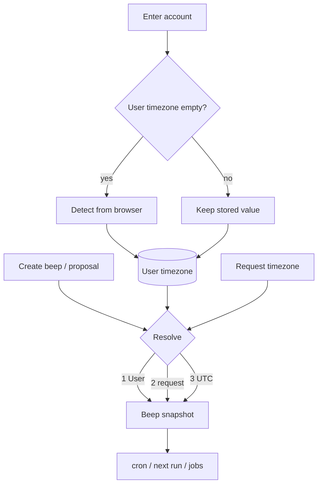

# Timezone

Membership preference lives on **User**. Scheduled work lives on **Beep**. Identity and Account have no timezone. Values are IANA names (`Asia/Shanghai`, `UTC`).

There is no request cookie and no per-request `Time.zone`. Jobs and cron only read `beep.timezone`.

## Authority

| Record                 | Role                                                                                  |
| ---------------------- | ------------------------------------------------------------------------------------- |
| **User**               | Preference for this membership (`detected` from the browser, or `manual` in settings) |
| **Beep**               | Snapshot. Changing the User timezone does not rewrite existing beeps                  |
| **Identity / Account** | No timezone                                                                           |

New memberships start empty. They are not copied from other accounts of the same person.

## How User timezone is set

1. Enter an account with a blank timezone → write the browser zone as `detected`.
2. Pick a zone in `/$slug/settings` → `manual`. Detect never overwrites after that.
3. v1 has no “reset to browser”. After lock, only choose another zone in settings.

The settings picker lists zones from tzdb (search + country flag). The live probe is still the browser’s current IANA name.

## How a new Beep gets its timezone

1. User timezone if set
2. Else the IANA on that create/proposal request (does not write User)
3. Else UTC

Create UI does not expose a timezone field. Updating a beep cannot change its timezone.
