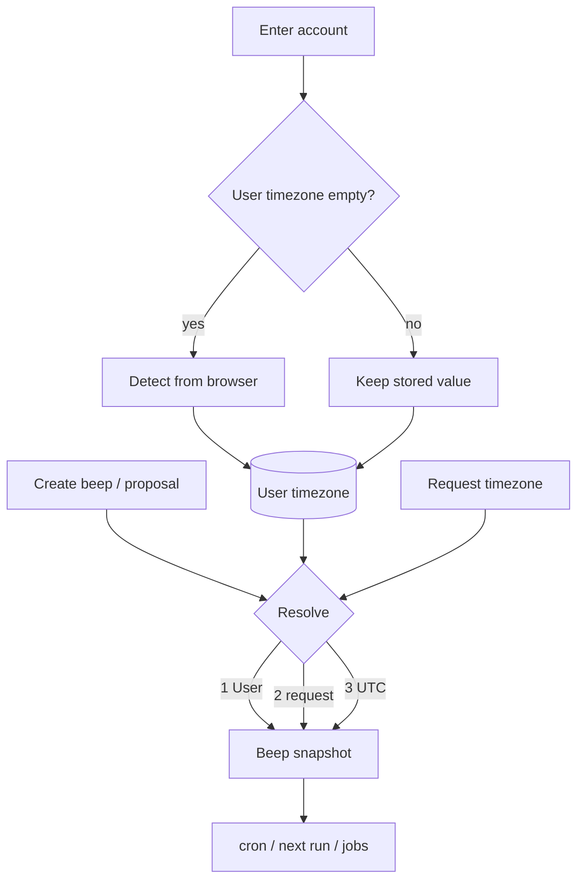

# Timezone

Membership preference lives on **User**. Scheduled work lives on **Beep**. Identity and Account have no timezone. Values are IANA names (`Asia/Shanghai`, `UTC`).

There is no request cookie and no per-request `Time.zone`. Jobs and cron only read `beep.timezone`.

## Authority

| Record                 | Role                                                                                  |
| ---------------------- | ------------------------------------------------------------------------------------- |
| **User**               | Preference for this membership (`detected` from the browser, or `manual` in settings) |
| **Beep**               | Snapshot. Changing the User timezone does not rewrite existing beeps                  |
| **Identity / Account** | No timezone                                                                           |

New memberships start empty. They are not copied from other accounts of the same person.

## How User timezone is set

1. Enter an account with a blank timezone → write the browser zone as `detected`.
2. Pick a zone in `/$slug/settings` → `manual`. Detect never overwrites after that.
3. v1 has no “reset to browser”. After lock, only choose another zone in settings.

The settings picker lists zones from tzdb (search + country flag). The live probe is still the browser’s current IANA name.

## How a new Beep gets its timezone

1. User timezone if set
2. Else the IANA on that create/proposal request (does not write User)
3. Else UTC

Create UI does not expose a timezone field. On create requests, a payload `timezone` does not override an already-configured user timezone. Updating a beep cannot change its stored timezone (though PATCH with `:at` can pass a transient `timezone` parameter to interpret local wall-clock time).

## Timestamp Lifecycle & Formatting Rules

Follows the standard Rails and modern REST API convention (*Basecamp / Fizzy, GitHub, Stripe*):

> **"Store in UTC, transmit in UTC (ISO 8601), format in Presentation Layer."**

| Stage                            | Responsibility | Implementation                                                                                                                |
| -------------------------------- | -------------- | ----------------------------------------------------------------------------------------------------------------------------- |
| **1. Store in UTC**              | Backend (DB)   | Database columns (`run_at`, `next_run_at`, `created_at`, etc.) always store standard UTC timestamps.                          |
| **2. Transmit in UTC (ISO 8601)**| API Contract   | API (Jbuilder) transmits timestamps as ISO 8601 UTC strings (`...Z`). CLI `--json` preserves these raw strings for scripts. |
| **3. Format in Presentation**    | Client UI      | Clients localize timestamps in the record's IANA timezone (`record.timezone`) for human display.                              |

### Why not format timestamps on the server?

1. **Preserve Instant & Offset**: `2026-09-23T10:00:00Z` is an unambiguous point in time. Returning a naked string like `2026-09-23 18:00:00` drops timezone offset/Z, turning an unambiguous instant into an ambiguous wall-clock string.
2. **Machine & Pipeline Friendliness**: Tools and scripts (`beep list --json | jq ...`) rely on standard ISO 8601 for sorting, comparing, and parsing.
3. **Display Diversity**: Presentation layers require various representations (absolute `YYYY-MM-DD HH:mm:ss`, compact/short dates, relative times like "5m ago"). Formatting on the server would lead to field bloat (`*_display`, `*_relative`, `*_short`).
4. **Thin Client Presentation**: Localizing standard ISO strings is trivial in modern runtimes (Web via native `Intl.DateTimeFormat`, CLI via Go's standard `time.LoadLocation`).

