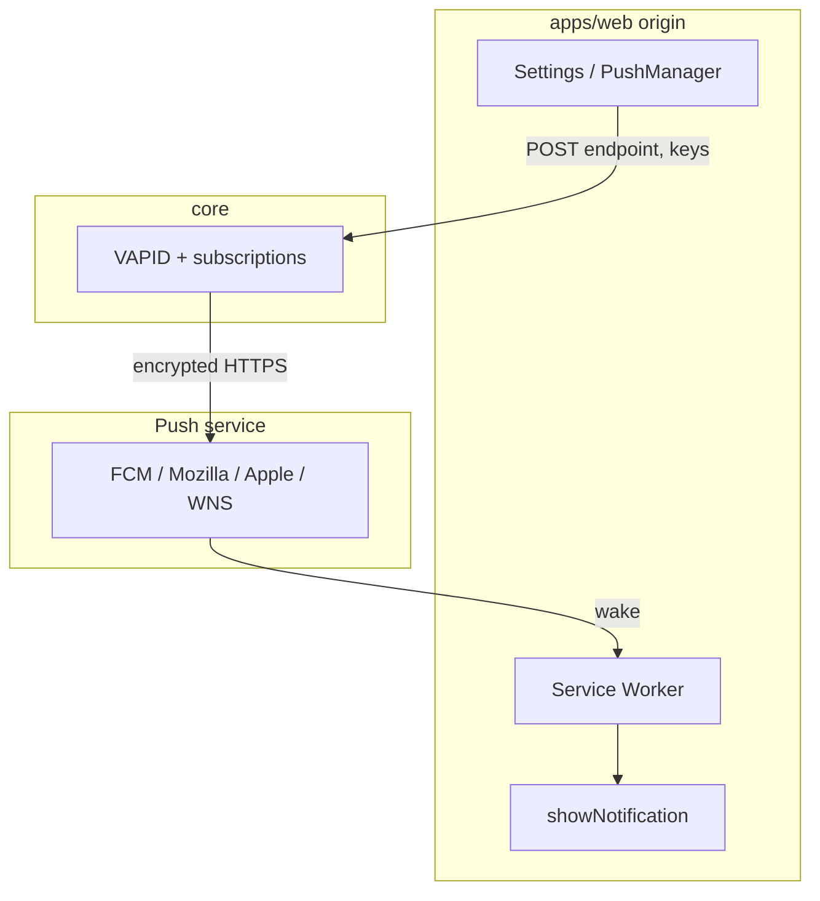

# Web Push

Spans `core` (VAPID, subscriptions, send) and `apps/web` (service worker, permission, settings). The service worker **must** live on the **web origin**. Core only stores subscriptions and POSTs to FCM / Mozilla / Apple / WNS.

Send path follows [Campfire](https://github.com/basecamp/once-campfire) / [Fizzy](https://github.com/basecamp/fizzy) (`web-push` + pool). Subscribe path must stay split: do not serve the worker from Rails `GET /service-worker`.

Terms: [`TERMS.md`](../TERMS.md). Channel is the delivery method; `push_subscriptions` are devices.



Constraints: HTTPS (`localhost` / `*.localhost` excepted); `userVisibleOnly`; iOS needs Home Screen; after the user revokes permission, the next send returns 410 and core should delete the row.

---

## Responsibilities

| Layer      | Does                                                                       | Does not                    |
| ---------- | -------------------------------------------------------------------------- | --------------------------- |
| `apps/web` | SW, permission, `subscribe`, settings, open web URL on notification click  | Hold the VAPID private key  |
| `core`     | VAPID, CRUD, endpoint checks, send, expire rows, write `beep_runs.result`  | Host the user-facing SW     |

Channel `web_push` means this beep may use browser push. A subscription is a device that can receive it. Several devices for one user are several rows, not several channels.

---

## Status

Subscribe is done. Due beeps **do not** push yet. Test sends with in-request `WebPush.payload_send` (no job, no pool).

- VAPID: `VAPID_PUBLIC_KEY` / `VAPID_PRIVATE_KEY`, `core/script/create-vapid-key.rb`, `GET /api/v1/web_push`
- Table `push_subscriptions`: `user_id` + `account_id`, unique `(user_id, endpoint)`, `endpoint` is `text`
- Create: HTTPS + host allowlist (FCM / Mozilla / Apple / WNS). No DNS on create (SQLite write lock)
- `SsrfProtection#resolved_endpoint_ip` exists; send does not pin IP yet
- API (jbuilder): `GET/POST/DELETE /api/v1/:slug/push_subscriptions`, `POST .../:id/test` (410 deletes that row)
- `apps/web`: unhashed `/service-worker.js`, settings, UA-based Tips, device list and remove

Rotating VAPID keys invalidates every subscription. Serve the public key from the API; do not bake it into the web bundle.

---

## Next (product loop)

1. **Poller → `DeliverBeepRunJob` → Channel** (`email` | `web_push`). Fan out to every subscription for the target user. No poller / `beep_runs` yet.
2. **`WebPush::Pool`**: do not POST to FCM inside the job thread. `net-http-persistent` is already in the Gemfile. Delivery pool sends; invalidation pool deletes expired rows (`Rails.application.executor.wrap`); `at_exit` shutdown.
3. **Delete on send**: 410 / 404 / `OpenSSL::OpenSSLError`. No TTL; stale devices go away on failed send or from settings.
4. **Pin IP on send**: pass `resolved_endpoint_ip` into `payload_send`. Skip if there is no public IP; never hit a private address.
5. **Payload and result**: `title` / `beep.message` / absolute web URL / `badge`; `urgency: "high"`. Zero subscriptions → `no_subscriptions` on the run.

```json
{
  "title": "Beep",
  "options": {
    "body": "<beep.message>",
    "data": { "url": "https://web…/<slug>/beeps/<id>", "badge": 1 }
  }
}
```

---

## Later

- Notification `icon`; app badge (installed PWA / Dock only — not a normal browser tab)
- iOS PWA (manifest, install prompt); copy-only today
- Attach subscriptions to `identity` so personal and team share one device

## Do not

Fizzy in-app tray / email bundles; Campfire “skip if online”; SW on core; native APNs; Turbo offline cache.
