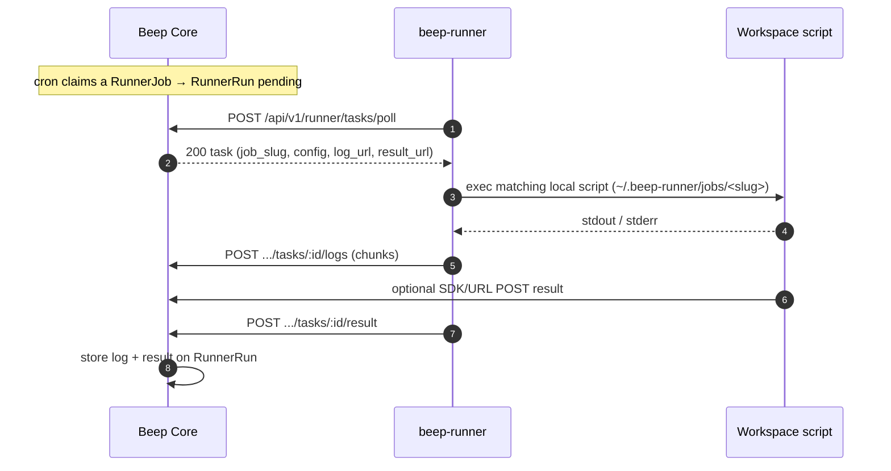

# Self-hosted Runner (Local Job Workspace) Code Review 指南

本指南用于 Review **Self-hosted Runner 完整功能与全新架构**（PR [#38](https://github.com/yuler/beep/pull/38)）的代码改动。

* **架构设计文档**：[`docs/architecture/runner.md`](docs/architecture/runner.md)
* **官方 Beeper 架构**：[`docs/architecture/beeper.md`](docs/architecture/beeper.md)
* **对应 PR**：[yuler/beep#38](https://github.com/yuler/beep/pull/38)
* **分支**：`feat/self-hosted-runner`

---

## 1. 核心架构设计 (Architecture Principles)

- **职责边界清晰**：官方 Beeper Apps（Site Uptime, SSL expiry, Heartbeat 等）保持由 Core 云端统一调度执行，不路由给 Runner。
- **本地工作区 (Local Job Workspace)**：Runner 作为运行在用户本地/内网机器上的常驻 Worker 进程，通过独立模型 `RunnerJob` 关联任务与本地脚本。
- **纯出站长轮询 (Pull-only HTTP)**：Go Runner 仅对外发起出站请求（GitLab Runner 风格），无需在内网开启任何入站端口。
- **脚本留在本地**：Core 仅保存任务元信息（`slug`、cron 表达式、时区、超时时间、自定义 `config` JSON）；Runner 节点在本地 `~/.beep-runner/jobs/<slug>` 或 `jobs.json` 中匹配并执行真实脚本。
- **日志与结果一流支持 (Streaming Logs & First-class Results)**：执行过程中实时流式分块上报 stdout/stderr，Core 限制单次执行日志上限（256KB）与结果上限（8KB）。
- **安全沙箱控制**：必须通过 `--allow-exec` 或 `BEEP_ALLOW_EXEC=true` 显式开启脚本执行权限。



---

## 2. 核心改动概览 (Change Scope)

```
beep monorepo
├── core/                                   # Rails 8.1 后端核心
│   ├── app/models/runner.rb                # Runner 节点模型、Token 鉴权、心跳与离线判定
│   ├── app/models/runner_job.rb            # RunnerJob 定时任务调度、cron 计算、状态机
│   ├── app/models/runner_run.rb            # RunnerRun 执行记录、日志截断与结果存储
│   ├── app/jobs/runner_job_poller_job.rb   # 定时轮询排期任务并回收超时任务
│   ├── app/controllers/api/v1/
│   │   ├── runners_controller.rb           # 用户控制台 Runner CRUD 与 Token 重新生成
│   │   ├── runner_jobs_controller.rb       # Runner Job CRUD
│   │   ├── runner_jobs/pauses_controller.rb# Runner Job 暂停与恢复调度
│   │   ├── runner_job_runs_controller.rb   # Runner Run 历史查询、日志详情与手动触发
│   │   └── runner/tasks_controller.rb      # Runner Agent 通信 API (poll, logs, result)
│   ├── app/views/api/v1/runner*/           # Jbuilder 视图契约 (runner, job, run, task)
│   ├── config/recurring.yml                # Solid Queue 定时调度配置 (每 10s poll_due_now)
│   └── test/                               # 单元与集成测试 (RunnerJob & Tasks API)
├── apps/web/                               # Web 前端控制台 (TanStack Start / React 19)
│   ├── src/routes/$account_slug/
│   │   ├── runners.tsx                     # Runner 节点列表管理主页面
│   │   └── runners_.$runnerId.tsx          # Runner 详情页 (Job 工作区管理、即时触发、日志查看器)
│   ├── src/components/runners/
│   │   ├── runner-list.tsx                 # Runner 节点卡片列表
│   │   ├── runner-form-dialog.tsx          # 添加/编辑 Runner 弹窗
│   │   └── runner-token-modal.tsx          # Token 引导弹窗 (多格式一键复制与独立滚动)
│   └── src/lib/api/
│       ├── runners.ts                      # Runner 节点 API Client
│       └── runner-jobs.ts                  # Runner Job & Run API Client
├── apps/runner/                            # Go 客户端 (beep-runner 单二进制与 Dockerfile)
│   ├── Dockerfile                          # 多架构轻量级镜像打包 (Go 多阶段静态编译)
│   ├── main.go                             # CLI 命令 (run, ping, test, version)
│   ├── internal/client/                    # HTTP 任务拉取、日志流式传输与结果上报客户端
│   ├── internal/daemon/                    # 常驻 Worker Pool 与并发调度器
│   ├── internal/exec/                      # 本地 Shell / 脚本安全执行与流式捕获引擎
│   ├── internal/workspace/                 # 本地工作区目录扫描与 jobs.json 映射解析
│   ├── internal/task/                      # Task 任务流编排
│   └── examples/                           # 官方示例脚本 (heartbeat-ping, intranet-http, jobs.json)
└── project.inlang/messages/                # 中英文国际化翻译词条
```

---

## 3. Review Checklist (检查清单)

### 3.1 数据库迁移与数据模型 (Data Models)
- [ ] [`core/db/migrate/20260901180000_create_runners_and_jobs.rb`](core/db/migrate/20260901180000_create_runners_and_jobs.rb)
  - [ ] `runners` 表使用 UUID 主键，`token_digest` 有唯一索引，包含 `allow_exec` 与 `last_seen_at` 字段。
  - [ ] `runner_jobs` 表包含 `account_id`、`runner_id`、`slug`（作用域在 runner_id 下唯一）、`cron`、`timezone`、`timeout_seconds`、`config` (jsonb)、`status`（active / paused / firing）、`next_run_at`、`last_run_at`。
  - [ ] `runner_runs` 表包含 `runner_job_id`、`runner_id`、`scheduled_for`、`status`（pending / running / succeeded / failed / expired）、`result_status`、`result` (jsonb)、`log` (text)。
  - [ ] 官方 `beepers` 与 `beeper_runs` 表保持干净，不侵入 runner 路由字段。
- [ ] [`core/app/models/runner.rb`](core/app/models/runner.rb)
  - [ ] Token 生成采用 `beep_rt_` 前缀 + 24 字节高熵随机串，数据库仅保存 SHA256 哈希值 (`token_digest`)。
  - [ ] `raw_token` 仅在 `create` 或 `regenerate_token!` 时在内存中短暂暴露一次。
  - [ ] `online?` 辅助方法依据状态与 `OFFLINE_TIMEOUT`（60s）判定节点在线状态。
  - [ ] `Runner.mark_stale_offline!` 超过 60 秒无心跳自动标记为 `offline`。
- [ ] [`core/app/models/runner_job.rb`](core/app/models/runner_job.rb)
  - [ ] 严格校验 `name`、`slug` 格式（小写字母数字短横线下划线）、IANA 时区合法性与 Cron 表达式有效性。
  - [ ] `sync_next_run_at` 正确根据 Cron 与 Timezone 自动推算下一次触发时间。
  - [ ] `poll_due_now` 定时拉取到期任务（`active` 且 `next_run_at <= now`），转为 `firing` 状态并生成 `pending` 状态的 `RunnerRun` 记录。
  - [ ] `reclaim_stale_firing` 自动回收长时间未认领或未上报的卡顿任务。
- [ ] [`core/app/models/runner_run.rb`](core/app/models/runner_run.rb)
  - [ ] `claim_for!(runner)` 原子将 `pending` 更新为 `running` 并设置 `claimed_at`，杜绝并发竞争重领。
  - [ ] `append_log!` 针对并发 chunk 上报加悲观锁，并硬性截断保留最新 256KB 日志。
  - [ ] `record_result!` 严格控制结果 JSON 结构并限制体积不超过 8KB，更新状态同时触发 `runner_job.finish_firing` 重新排期。

### 3.2 Core API 端点与安全性 (Security & Core API)
- [ ] [`core/config/initializers/account_slug.rb`](core/config/initializers/account_slug.rb)
  - [ ] `runner` 与 `runners` 正确加入 `RESERVED_FROM_ROUTES` 保留字，防止路由中间件将其误识别为租户 slug。
- [ ] [`core/app/controllers/api/v1/runner/base_controller.rb`](core/app/controllers/api/v1/runner/base_controller.rb)
  - [ ] 支持 `X-Runner-Token` 请求头或 `Authorization: Bearer <token>` 认证，更新节点 `last_seen_at` 并自动标记 `online`。
- [ ] [`core/app/controllers/api/v1/runner/tasks_controller.rb`](core/app/controllers/api/v1/runner/tasks_controller.rb)
  - [ ] `POST /poll`：只拉取分配给当前 Runner 的待执行任务，返回 `job_slug`、`config`、`log_url`、`result_url` 等上下文。
  - [ ] `POST /:id/logs`：安全接收文本或 JSON 日志 chunk 并追加至运行记录。
  - [ ] `POST /:id/result`：安全接收 `ok` / `alerting` / `error` 结果指标并更新运行状态。
- [ ] [`core/app/controllers/api/v1/runners_controller.rb`](core/app/controllers/api/v1/runners_controller.rb)
  - [ ] 严格按 `Current.account` 租户边界过滤，提供 Runner CRUD 与 Token 重新生成。
- [ ] [`core/app/controllers/api/v1/runner_jobs_controller.rb`](core/app/controllers/api/v1/runner_jobs_controller.rb) & [`runner_job_runs_controller.rb`](core/app/controllers/api/v1/runner_job_runs_controller.rb)
  - [ ] 完整提供 Job 列表、新建、详情、删除、暂停/恢复，以及 Run 列表、实时日志查看和手动立即触发。

### 3.3 Web 管理 UI (`apps/web`)
- [ ] **Runner 控制台与列表** ([`apps/web/src/routes/$account_slug/runners.tsx`](apps/web/src/routes/$account_slug/runners.tsx) & [`runner-list.tsx`](apps/web/src/components/runners/runner-list.tsx))
  - [ ] 状态 Badge 区分在线（绿色脉冲）、空闲（蓝色）、离线（灰色）。
  - [ ] 展示版本号、系统架构、主机名、IP 地址、关联 Job 数量、最后活跃时间与 exec 权限标签。
  - [ ] 点击卡片直接下钻到 Runner 详情及 Job 管理页。
- [ ] **Runner 详情与 Job 工作区管理** ([`apps/web/src/routes/$account_slug/runners_.$runnerId.tsx`](apps/web/src/routes/$account_slug/runners_.$runnerId.tsx))
  - [ ] 左侧展示 Runner 基本信息与所有绑定的 Runner Jobs 列表。
  - [ ] 支持新建 Job（输入 Name、Slug、Cron 表达式、时区、超时时间）。
  - [ ] 支持单个 Job 快捷操作：暂停/恢复调度、立即触发运行、删除 Job。
  - [ ] 右侧展示选中 Job 的历史运行记录列表与状态 Badge。
  - [ ] 下方提供实时日志流查看器（Terminal 风格展示日志文本、执行结果状态与指标 JSON，带一键复制日志功能）。
- [ ] **Token 接入与运行引导弹窗** ([`apps/web/src/components/runners/runner-token-modal.tsx`](apps/web/src/components/runners/runner-token-modal.tsx))
  - [ ] 弹窗容器设置 `overflow-x-hidden min-w-0`，杜绝弹窗自身横向滚动。
  - [ ] 代码块容器具备独立 `overflow-x-auto whitespace-pre` 横向滚动能力。
  - [ ] 在标题栏与代码块右上角均提供快捷复制按钮，并附带即时复制成功状态反馈。
  - [ ] 启动命令包含 `--workspace` 与 `--allow-exec` 说明。

### 3.4 Go Runner 客户端与 Docker 打包 (`apps/runner`)
- [ ] **工作区目录与脚本发现** ([`apps/runner/internal/workspace/workspace.go`](apps/runner/internal/workspace/workspace.go))
  - [ ] 默认读取 `~/.beep-runner` 工作区目录（可通过 `--workspace` 自定义）。
  - [ ] 自动发现 `jobs/<slug>` 脚本文件（支持 `.sh`, `.py`, `.js` 或可执行二进制），或由 `jobs.json` 显式配置。
- [ ] **脚本执行引擎与环境变量注入** ([`apps/runner/internal/exec/exec.go`](apps/runner/internal/exec/exec.go))
  - [ ] 必须显式开启 `--allow-exec` 或 `BEEP_ALLOW_EXEC=true` 才允许运行脚本。
  - [ ] 执行时自动注入环境参数：`BEEP_SERVER`, `BEEP_RUNNER_TOKEN`, `BEEP_RUN_ID`, `BEEP_JOB_SLUG`, `BEEP_LOG_URL`, `BEEP_RESULT_URL`, `BEEP_CONFIG`, `BEEP_CONFIG_*`。
  - [ ] 实时捕获 stdout / stderr 并分块流式上传至 Core。
- [ ] **Worker Pool 调度器与生命周期** ([`apps/runner/internal/daemon/daemon.go`](apps/runner/internal/daemon/daemon.go))
  - [ ] 基于 channel semaphore 控制并发度 (`--concurrency`)。
  - [ ] 优雅退出处理（监听 `SIGINT` / `SIGTERM`，等待执行中的任务完成后再退出）。
- [ ] **CLI 入口与官方示例** ([`main.go`](apps/runner/main.go) & [`apps/runner/examples/`](apps/runner/examples/))
  - [ ] 支持 `run`, `ping`, `test`, `version` 等子命令。
  - [ ] 提供开箱即用的示例脚本：`heartbeat-ping.sh`、`intranet-http.sh`、`jobs.json`。

---

## 4. 本地验证步骤 (Verification Steps)

### Step 1: 运行后端、前端与客户端自动化测试
```bash
# 1. 运行 Core 后端全量测试 (包含 Runner、RunnerJob 与 Tasks API 测试)
cd core && bin/rails test

# 2. 运行 Web 前端类型与 Biome 检查
pnpm --filter web check
pnpm --filter web build

# 3. 运行 Go Runner 客户端全量单元测试
cd apps/runner && go test -v ./...
```

### Step 2: 编译与测试 Go Runner CLI
```bash
# 在项目根目录编译
cd apps/runner && go build -o ../../bin/beep-runner ./main.go && cd ../..

# 1. 查看版本输出与帮助
./bin/beep-runner version
./bin/beep-runner --help

# 2. 本地持久化配置 Server 与 Token
./bin/beep-runner config set --server http://core.beep.localhost:3000 --token <YOUR_TOKEN> --allow-exec

# 3. 查看当前有效配置
./bin/beep-runner config
```

### Step 3: Web 端到端管理与本地脚本执行联调
1. 启动全栈开发环境：`mise dev`
2. 打开浏览器访问 `http://web.beep.localhost:3000` 并登录。
3. 进入左侧侧边栏 **Runners**（`/$slug/runners`）：
   - 点击 **Add Runner** 创建一个节点（例如 `Office-Mac`，标签 `intranet`，开启 allow exec）。
   - 弹窗中复制生成的 Token（`beep_rt_xxx`）及快速配置命令。
4. 使用 CLI 一键配置节点与创建本地 Job：
   ```bash
   # 1. 一键保存认证信息与服务端地址
   ./bin/beep-runner config set --server http://core.beep.localhost:3000 --token <YOUR_TOKEN> --allow-exec

   # 2. 一键创建本地脚本并自动注册到服务端
   ./bin/beep-runner job create intranet-http --cron "* * * * *" --name "Intranet HTTP Check"
   ```
5. 启动 Runner 守护进程：
   ```bash
   ./bin/beep-runner run
   ```
6. 刷新 Web 页面：
   - Runner 列表显示状态为 `Online`（绿色脉冲）。
   - 点击该 Runner 进入详情页（`/$slug/runners/<runner_id>`），可看到已自动注册的 `Intranet HTTP Check` 任务。
7. 验证执行与日志查看：
   - 点击 **Trigger Run** 立即触发执行。
   - 在终端可观察到 Runner 领取任务并执行 `~/.beep-runner/jobs/intranet-http.sh`。
   - Web 页面历史运行列表中出现新 Run 记录，点击可即时查看实时输出的日志和执行结果指标。
